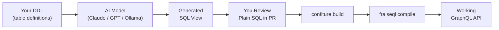

import { Tabs, TabItem, Aside, Card, CardGrid, Steps } from '@astrojs/starlight/components';

This guide walks through the complete workflow for generating FraiseQL SQL views with an AI assistant. Each step includes copy-paste prompts, example inputs and outputs, and a review checklist.

## Prerequisites

- FraiseQL installed and a project initialized
- A database with at least one table
- Access to an LLM: Claude, GPT-4o, or a local model via Ollama

## Workflow



---

## Step 1: Export Your DDL

Give the LLM your table definitions. Export them from your database:

<Tabs syncKey="db">
  <TabItem label="PostgreSQL">
    ```bash
    # Export all tables in your schema
    pg_dump --schema-only --no-owner -t 'tb_*' your_database > ddl.sql

    # Or extract specific tables from psql
    psql your_database -c "\d+ tb_user"
    psql your_database -c "\d+ tb_post"
    ```
  </TabItem>
  <TabItem label="MySQL">
    ```bash
    # Export table definitions
    mysqldump --no-data --compact your_database > ddl.sql

    # Or show specific tables
    mysql your_database -e "SHOW CREATE TABLE tb_user\G"
    mysql your_database -e "SHOW CREATE TABLE tb_post\G"
    ```
  </TabItem>
  <TabItem label="SQLite">
    ```bash
    # Export schema from SQLite
    sqlite3 your_database.db ".schema"

    # Or specific tables
    sqlite3 your_database.db ".schema tb_user"
    sqlite3 your_database.db ".schema tb_post"
    ```
  </TabItem>
  <TabItem label="SQL Server">
    ```sql
    -- Script table definitions in SSMS or via sqlcmd
    SELECT OBJECT_DEFINITION(OBJECT_ID('dbo.tb_user'));
    SELECT OBJECT_DEFINITION(OBJECT_ID('dbo.tb_post'));
    ```
  </TabItem>
</Tabs>

---

## Step 2: Set the Context with the Master System Prompt

Use this system prompt at the start of every conversation. It loads the LLM with everything it needs to generate correct FraiseQL views.

```
You are a FraiseQL SQL expert. FraiseQL maps SQL views to GraphQL types.

NAMING CONVENTIONS (always follow exactly):
- Tables:       tb_<entity>     (e.g., tb_user, tb_post)
- Views:        v_<entity>      (e.g., v_user, v_post)
- Primary keys: pk_<entity>     (e.g., pk_user, pk_post)
- Foreign keys: fk_<referenced> (e.g., fk_user, fk_post)
- Surrogate ID: id UUID         (exposed in GraphQL, not pk_*)

VIEW STRUCTURE RULES:
1. Every view must SELECT: the surrogate `id` column AND a `data` column
2. The `data` column is a JSON object built from the entity's fields
3. Use the database-appropriate JSON builder (see below)
4. Embed related entities by joining to their view and including `v_related.data`
5. For arrays (one-to-many), use the database-appropriate array aggregator
6. Always use the surrogate `id` (UUID), not the integer pk_* in GraphQL output
7. Prefix JSON keys with no table alias — use field names directly

DATABASE-SPECIFIC JSON FUNCTIONS:
- PostgreSQL:  jsonb_build_object(...) for objects, jsonb_agg(...) for arrays
- MySQL:       JSON_OBJECT(...) for objects, JSON_ARRAYAGG(...) for arrays
- SQLite:      json_object(...) for objects, json_group_array(...) for arrays
- SQL Server:  FOR JSON PATH, WITHOUT_ARRAY_WRAPPER for objects; FOR JSON PATH for arrays

MUTATION FUNCTIONS:
- fn_create_<entity>(args...) RETURNS UUID
- fn_update_<entity>(p_id UUID, args...) RETURNS BOOLEAN
- fn_delete_<entity>(p_id UUID) RETURNS BOOLEAN

When I give you a DDL, generate the corresponding view(s). Output only SQL — no explanation unless I ask.
```

<Aside type="tip">
  Paste this system prompt once at the start of your chat session. Then use the scenario-specific prompts below. You do not need to repeat the system prompt for each view.
</Aside>

---

## Step 3: Request Views with Scenario Prompts

Pick the template that matches your scenario.

### Single Table — Basic Entity

**When to use:** A table with scalar fields only. No relationships.

**Prompt:**
```
Generate a FraiseQL view for this table:

[PASTE YOUR DDL HERE]

Output: v_<entity> view only.
```

**Example input (PostgreSQL):**
```sql
CREATE TABLE tb_product (
    pk_product  INTEGER GENERATED ALWAYS AS IDENTITY PRIMARY KEY,
    id          UUID DEFAULT gen_random_uuid() UNIQUE NOT NULL,
    name        TEXT NOT NULL,
    price       NUMERIC(10, 2) NOT NULL,
    sku         TEXT NOT NULL UNIQUE,
    in_stock    BOOLEAN NOT NULL DEFAULT true,
    created_at  TIMESTAMPTZ DEFAULT NOW()
);
```

**Example output:**
```sql
CREATE VIEW v_product AS
SELECT
    p.id,
    jsonb_build_object(
        'id',         p.id::text,
        'name',       p.name,
        'price',      p.price,
        'sku',        p.sku,
        'in_stock',   p.in_stock,
        'created_at', p.created_at
    ) AS data
FROM tb_product p;
```

**What to check:** All columns included, `id` cast to `text`, no `pk_product` in the output.

---

### One-to-Many — Parent with Children Array

**When to use:** A parent entity that has multiple related child records.

**Prompt:**
```
Generate a FraiseQL view for a one-to-many relationship.

Parent table:
[PASTE PARENT DDL]

Child table:
[PASTE CHILD DDL]

The parent should embed children as an array in its `data` column.
Child view v_<child> already exists — use it.
Output: v_<parent> view only.
```

**Example input (PostgreSQL):**
```sql
-- Parent
CREATE TABLE tb_author (
    pk_author  INTEGER GENERATED ALWAYS AS IDENTITY PRIMARY KEY,
    id         UUID DEFAULT gen_random_uuid() UNIQUE NOT NULL,
    name       TEXT NOT NULL,
    bio        TEXT
);

-- Child (already has v_post view)
CREATE TABLE tb_post (
    pk_post    INTEGER GENERATED ALWAYS AS IDENTITY PRIMARY KEY,
    id         UUID DEFAULT gen_random_uuid() UNIQUE NOT NULL,
    fk_author  INTEGER NOT NULL REFERENCES tb_author(pk_author),
    title      TEXT NOT NULL,
    body       TEXT NOT NULL,
    published  BOOLEAN DEFAULT false
);
```

**Example output:**
```sql
CREATE VIEW v_author AS
SELECT
    a.id,
    jsonb_build_object(
        'id',    a.id::text,
        'name',  a.name,
        'bio',   a.bio,
        'posts', COALESCE(
            (
                SELECT jsonb_agg(vp.data ORDER BY p.pk_post)
                FROM tb_post p
                JOIN v_post vp ON vp.id = p.id
                WHERE p.fk_author = a.pk_author
            ),
            '[]'::jsonb
        )
    ) AS data
FROM tb_author a;
```

**What to check:** `COALESCE(..., '[]'::jsonb)` prevents null arrays. The subquery uses the existing `v_post` view, not raw columns.

---

### Many-to-Many — Junction Table

**When to use:** Two entities connected through a junction table.

**Prompt:**
```
Generate a FraiseQL view for a many-to-many relationship via a junction table.

Entity A table:
[PASTE DDL]

Entity B table:
[PASTE DDL]

Junction table:
[PASTE DDL]

v_<entity_b> already exists.
Generate v_<entity_a> that embeds a list of entity_b items.
```

**Example input (PostgreSQL):**
```sql
CREATE TABLE tb_article (
    pk_article  INTEGER GENERATED ALWAYS AS IDENTITY PRIMARY KEY,
    id          UUID DEFAULT gen_random_uuid() UNIQUE NOT NULL,
    title       TEXT NOT NULL
);

CREATE TABLE tb_tag (
    pk_tag  INTEGER GENERATED ALWAYS AS IDENTITY PRIMARY KEY,
    id      UUID DEFAULT gen_random_uuid() UNIQUE NOT NULL,
    name    TEXT NOT NULL
);

CREATE TABLE tb_article_tag (
    fk_article  INTEGER NOT NULL REFERENCES tb_article(pk_article),
    fk_tag      INTEGER NOT NULL REFERENCES tb_tag(pk_tag),
    PRIMARY KEY (fk_article, fk_tag)
);
```

**Example output:**
```sql
CREATE VIEW v_article AS
SELECT
    a.id,
    jsonb_build_object(
        'id',    a.id::text,
        'title', a.title,
        'tags',  COALESCE(
            (
                SELECT jsonb_agg(vt.data)
                FROM tb_article_tag at
                JOIN tb_tag t ON t.pk_tag = at.fk_tag
                JOIN v_tag vt ON vt.id = t.id
                WHERE at.fk_article = a.pk_article
            ),
            '[]'::jsonb
        )
    ) AS data
FROM tb_article a;
```

---

### Aggregation — Computed Fields

**When to use:** You need counts, sums, averages, or other computed values in the GraphQL response.

**Prompt:**
```
Generate a FraiseQL view with aggregated/computed fields.

Main table:
[PASTE DDL]

Related table to aggregate:
[PASTE DDL]

Computed fields needed:
- [describe what to compute, e.g., "count of active orders", "total revenue"]

Output: v_<entity> view with computed fields in data.
```

**Example output (PostgreSQL — order with item aggregates):**
```sql
CREATE VIEW v_order AS
SELECT
    o.id,
    jsonb_build_object(
        'id',          o.id::text,
        'status',      o.status,
        'created_at',  o.created_at,
        'item_count',  (
            SELECT COUNT(*)
            FROM tb_order_item oi
            WHERE oi.fk_order = o.pk_order
        ),
        'total',       (
            SELECT COALESCE(SUM(oi.price * oi.quantity), 0)
            FROM tb_order_item oi
            WHERE oi.fk_order = o.pk_order
        )
    ) AS data
FROM tb_order o;
```

---

### Filtered View — Soft Deletes, Tenant Isolation, Published-Only

**When to use:** You need a view that only exposes a subset of rows — deleted records hidden, data scoped to a tenant, or draft content excluded.

**Prompt:**
```
Generate a FraiseQL view that filters rows.

Table:
[PASTE DDL]

Filter rules:
- [describe the filter, e.g., "exclude rows where deleted_at IS NOT NULL"]
- [e.g., "only include rows where tenant_id = current_setting('app.tenant_id')::uuid"]
- [e.g., "only include rows where published = true"]

Output: v_<entity> view with filters applied in the WHERE clause.
```

**Example output (PostgreSQL — published posts with soft delete):**
```sql
CREATE VIEW v_published_post AS
SELECT
    p.id,
    jsonb_build_object(
        'id',           p.id::text,
        'title',        p.title,
        'body',         p.body,
        'published_at', p.published_at
    ) AS data
FROM tb_post p
WHERE p.published = true
  AND p.deleted_at IS NULL;
```

**Example output (PostgreSQL — tenant-isolated):**
```sql
CREATE VIEW v_tenant_document AS
SELECT
    d.id,
    jsonb_build_object(
        'id',    d.id::text,
        'title', d.title,
        'body',  d.body
    ) AS data
FROM tb_document d
WHERE d.tenant_id = current_setting('app.tenant_id')::uuid;
```

<Aside type="caution" title="Verify tenant isolation">
  Always manually verify row-level filters. An LLM-generated tenant filter is a starting point — review the WHERE clause carefully before deploying to production.
</Aside>

---

### Full Application — Multi-Table from a Description

**When to use:** You have a schema description and want views for all entities at once.

**Prompt:**
```
I'm building [describe your application in 1-2 sentences].

Here are all my table definitions:

[PASTE ALL DDLs]

Generate FraiseQL views for all entities. For relationships:
- Embed single related entities directly in data
- Embed arrays of related entities using jsonb_agg

Generate views in dependency order (views that are referenced by others come first).
Output SQL only.
```

<Aside type="tip">
  For large schemas (10+ tables), break this into groups: first generate leaf views (no relationships), then views that embed them. This keeps each generation focused.
</Aside>

---

### Mutation Functions

**When to use:** You need `fn_create_*`, `fn_update_*`, or `fn_delete_*` functions for the write path.

**Prompt:**
```
Generate FraiseQL mutation functions for this table.

Table:
[PASTE DDL]

Generate:
1. fn_create_<entity>(args...) — insert a row, return the new UUID id
2. fn_update_<entity>(p_id UUID, args...) — update by UUID id, return BOOLEAN
3. fn_delete_<entity>(p_id UUID) — soft delete by setting deleted_at, return BOOLEAN
   (if no deleted_at column, do a hard delete)

Use the pk_* column for internal lookups but never expose it in return values.
```

**Example output (PostgreSQL):**
```sql
CREATE OR REPLACE FUNCTION fn_create_product(
    p_name      TEXT,
    p_price     NUMERIC(10, 2),
    p_sku       TEXT
) RETURNS UUID AS $$
DECLARE
    v_id UUID;
BEGIN
    INSERT INTO tb_product (name, price, sku)
    VALUES (p_name, p_price, p_sku)
    RETURNING id INTO v_id;

    RETURN v_id;
END;
$$ LANGUAGE plpgsql;

CREATE OR REPLACE FUNCTION fn_update_product(
    p_id    UUID,
    p_name  TEXT,
    p_price NUMERIC(10, 2),
    p_sku   TEXT
) RETURNS BOOLEAN AS $$
BEGIN
    UPDATE tb_product
    SET name  = p_name,
        price = p_price,
        sku   = p_sku
    WHERE id = p_id;

    RETURN FOUND;
END;
$$ LANGUAGE plpgsql;

CREATE OR REPLACE FUNCTION fn_delete_product(
    p_id UUID
) RETURNS BOOLEAN AS $$
BEGIN
    DELETE FROM tb_product WHERE id = p_id;
    RETURN FOUND;
END;
$$ LANGUAGE plpgsql;
```

---

## Step 4: Review Checklist

Before applying any generated view, check these seven things:

<Steps>
1. **`id` column is the UUID surrogate** — the view selects `entity.id` (UUID), not `pk_entity` (integer). The integer primary key must never appear in GraphQL output.

2. **`data` column is present** — every view must have exactly two columns: `id` and `data`. If the output has more, it is wrong.

3. **Embedded views are referenced correctly** — when a view embeds another (e.g., `v_user.data` inside `v_post`), the join goes through the junction table's foreign key to the view's `id`, not to `pk_*`.

4. **Arrays are COALESCE-wrapped** — `jsonb_agg` returns NULL when there are no rows. Wrap with `COALESCE(..., '[]'::jsonb)` to return an empty array instead.

5. **Security filters are present** — if the view should be tenant-scoped, check that the WHERE clause filters on `tenant_id`. If rows should be soft-deleted, check for `deleted_at IS NULL`.

6. **Text casts are applied to UUIDs** — in PostgreSQL, `id::text` is required in the JSON object to serialize UUIDs as strings. If the cast is missing, add it.

7. **Run it before compiling** — test the view directly in your database before running `confiture build`:
   ```sql
   SELECT data FROM v_product LIMIT 5;
   ```
   Inspect the output. Verify the JSON structure matches your GraphQL type.
</Steps>

---

## Step 5: Apply and Compile

Once the view passes review:

```bash
# Apply the view to your database via confiture
confiture build

# Compile the GraphQL mapping
fraiseql compile

# Start the server
fraiseql run
```

Your GraphQL API is live. Query it to verify:

```graphql
query {
  products {
    id
    name
    price
    sku
  }
}
```

---

## Local Model Setup (Ollama)

For air-gapped environments or teams that cannot send schemas to cloud APIs, Ollama provides capable local models.

**Install and pull a model:**
```bash
# Install Ollama (https://ollama.com)
curl -fsSL https://ollama.com/install.sh | sh

# Pull a model — qwen2.5-coder:7b is the recommended starting point
ollama pull qwen2.5-coder:7b

# Start the server
ollama serve
```

**Recommended models for SQL generation:**

| Model | Size | Notes |
|-------|------|-------|
| `qwen2.5-coder:7b` | 7B | Best small model for SQL. Follows the FraiseQL pattern reliably. |
| `qwen2.5-coder:14b` | 14B | Better for complex multi-table schemas. |
| `llama3.1:8b` | 8B | Good general coverage, slightly weaker on edge cases. |
| `deepseek-coder:6.7b` | 6.7B | Strong at code generation tasks including SQL. |

**Use via Ollama API:**
```bash
curl http://localhost:11434/api/chat -d '{
  "model": "qwen2.5-coder:7b",
  "messages": [
    {
      "role": "system",
      "content": "[PASTE MASTER SYSTEM PROMPT HERE]"
    },
    {
      "role": "user",
      "content": "Generate a v_product view for:\n\nCREATE TABLE tb_product (\n    pk_product INTEGER GENERATED ALWAYS AS IDENTITY PRIMARY KEY,\n    id UUID DEFAULT gen_random_uuid() UNIQUE NOT NULL,\n    name TEXT NOT NULL,\n    price NUMERIC(10, 2) NOT NULL\n);"
    }
  ],
  "stream": false
}'
```

**Or use the Ollama CLI:**
```bash
ollama run qwen2.5-coder:7b
```
Then paste the system prompt and your request interactively.

<Aside type="note" title="Local model quality">
  7B models handle single-table and simple relationship views well. For complex aggregations or multi-table schemas, use `qwen2.5-coder:14b` or a cloud model. Always apply the review checklist regardless of which model you use.
</Aside>

---

## Iterating on Generated Output

If the first output is not quite right, be specific:

```
The view you generated is missing a COALESCE around the jsonb_agg call for
the `comments` array. Fix that and also add the `published_at` field from
the tb_post table — it was in the DDL but missing from the output.
```

The model has your DDL in context. Small corrections are usually accurate on the first retry.

If the view is structurally wrong (wrong join logic, missing relationships), re-state the relationship explicitly:

```
tb_comment.fk_post references tb_post.pk_post (not tb_post.id).
The join should be: JOIN tb_comment c ON c.fk_post = p.pk_post
Regenerate v_post with the corrected comments subquery.
```
