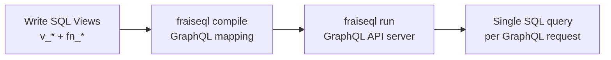
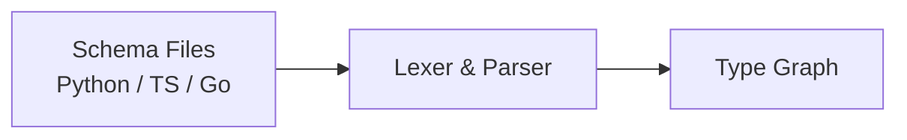
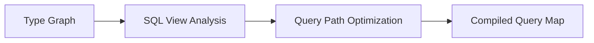
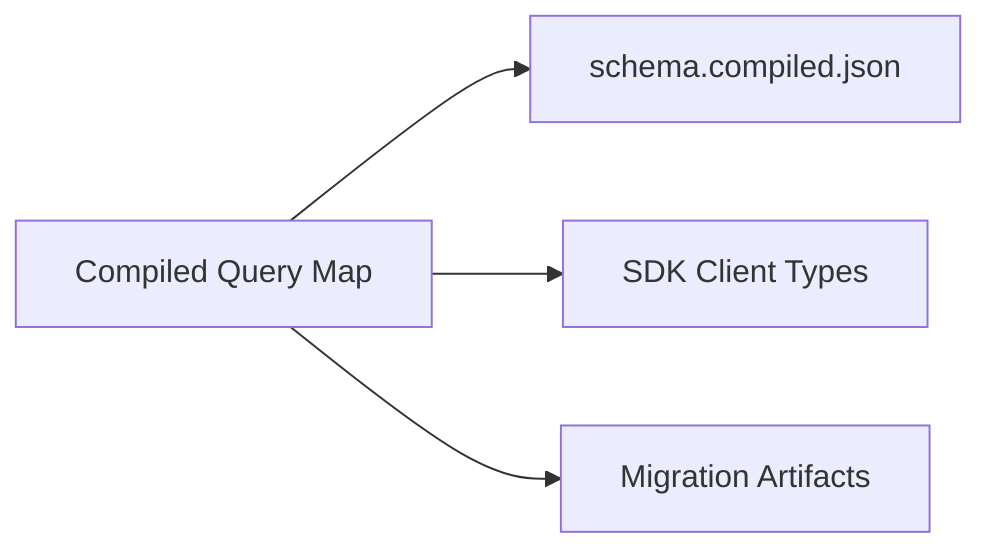

import { Tabs, TabItem, Aside } from '@astrojs/starlight/components';
import EmbeddedSandbox from '../../../components/EmbeddedSandbox.astro';

FraiseQL is a **database-first GraphQL framework**. You write SQL views that compose nested JSONB responses. FraiseQL maps your GraphQL types to those views. At runtime, every query resolves to a single SQL statement — no resolvers, no N+1, no DataLoader.

## Why this approach exists

With a traditional GraphQL framework, a schema change cascades across multiple layers:

1. Alter the database table
2. Update the ORM model
3. Regenerate GraphQL types
4. Update resolvers
5. Test everything together

With FraiseQL, the same change is localised:

1. Update the SQL view (or add a column to it)
2. Run `fraiseql compile`
3. Done — the API reflects the view

The compile step is the key: FraiseQL reads your views and Python decorators, validates that everything aligns, and produces a compiled description of the API that the server executes without further interpretation. The database schema and the API schema are decoupled — a view is the contract between them.

## The Three Layers



### 1. Write SQL Views

You write SQL views following a simple pattern: each view has an `id` column and a `data` JSONB column containing the complete response for that entity.

<Tabs syncKey="db">
  <TabItem label="PostgreSQL">
    ```sql title="db/schema/02_read/v_user.sql"
    CREATE VIEW v_user AS
    SELECT
        u.id,
        jsonb_build_object(
            'id', u.id::text,
            'name', u.name,
            'email', u.email
        ) AS data
    FROM tb_user u;
    ```

    Views compose other views. A post view embeds its author by referencing `v_user.data`:

    ```sql title="db/schema/02_read/v_post.sql"
    CREATE VIEW v_post AS
    SELECT
        p.id,
        jsonb_build_object(
            'id', p.id::text,
            'title', p.title,
            'content', p.content,
            'author', vu.data
        ) AS data
    FROM tb_post p
    JOIN tb_user u ON u.pk_user = p.fk_user
    JOIN v_user vu ON vu.id = u.id;
    ```
  </TabItem>

  <TabItem label="MySQL">
    ```sql title="db/schema/02_read/v_user.sql"
    CREATE VIEW v_user AS
    SELECT
        u.id,
        JSON_OBJECT(
            'id', u.id,
            'name', u.name,
            'email', u.email
        ) AS data
    FROM tb_user u;
    ```

    Views compose other views. A post view embeds its author by referencing `v_user.data`:

    ```sql title="db/schema/02_read/v_post.sql"
    CREATE VIEW v_post AS
    SELECT
        p.id,
        JSON_OBJECT(
            'id', p.id,
            'title', p.title,
            'content', p.content,
            'author', vu.data
        ) AS data
    FROM tb_post p
    JOIN tb_user u ON u.pk_user = p.fk_user
    JOIN v_user vu ON vu.id = u.id;
    ```
  </TabItem>

  <TabItem label="SQLite">
    ```sql title="db/schema/02_read/v_user.sql"
    CREATE VIEW v_user AS
    SELECT
        u.id,
        json_object(
            'id', u.id,
            'name', u.name,
            'email', u.email
        ) AS data
    FROM tb_user u;
    ```

    Views compose other views. A post view embeds its author by referencing `v_user.data`:

    ```sql title="db/schema/02_read/v_post.sql"
    CREATE VIEW v_post AS
    SELECT
        p.id,
        json_object(
            'id', p.id,
            'title', p.title,
            'content', p.content,
            'author', vu.data
        ) AS data
    FROM tb_post p
    JOIN tb_user u ON u.pk_user = p.fk_user
    JOIN v_user vu ON vu.id = u.id;
    ```
  </TabItem>

  <TabItem label="SQL Server">
    ```sql title="db/schema/02_read/v_user.sql"
    CREATE VIEW dbo.v_user
    WITH SCHEMABINDING AS
    SELECT
        u.id,
        (
            SELECT u.id, u.name, u.email
            FOR JSON PATH, WITHOUT_ARRAY_WRAPPER
        ) AS data
    FROM dbo.tb_user u;
    ```

    Views compose other views. A post view embeds its author by referencing `v_user.data`:

    ```sql title="db/schema/02_read/v_post.sql"
    CREATE VIEW dbo.v_post
    WITH SCHEMABINDING AS
    SELECT
        p.id,
        (
            SELECT p.id, p.title, p.content, vu.data AS author
            FOR JSON PATH, WITHOUT_ARRAY_WRAPPER
        ) AS data
    FROM dbo.tb_post p
    JOIN dbo.tb_user u ON u.pk_user = p.fk_user
    JOIN dbo.v_user vu ON vu.id = u.id;
    ```
  </TabItem>
</Tabs>

**Key insight:** Each view owns its fields. Add a field to `v_user` once, and every view that embeds `v_user.data` gets it automatically. No duplication.

**This is SQL you write, review, and own.** You can use CTEs, window functions, stored procedures, custom aggregations — the full power of your database. FraiseQL works with PostgreSQL, SQL Server, MySQL, and SQLite (extensible to any database with a Rust driver). Or you can ask an LLM to generate the views. The pattern is consistent enough that local models produce accurate results.

### 2. Define GraphQL Types

Define your GraphQL schema in your preferred programming language:

<Tabs syncKey="lang">
  <TabItem label="Python">
    ```python title="schema.py"
    import fraiseql

    @fraiseql.type
    class User:
        id: str
        name: str
        email: str
        posts: list['Post']

    @fraiseql.type
    class Post:
        id: str
        title: str
        content: str
        author: User
    ```
  </TabItem>
  <TabItem label="TypeScript">
    ```typescript title="schema.ts"
    import { Type, field } from 'fraiseql';

    @Type()
    class User {
      @field() id!: string;
      @field() name!: string;
      @field() email!: string;
      @field() posts!: Post[];
    }

    @Type()
    class Post {
      @field() id!: string;
      @field() title!: string;
      @field() content!: string;
      @field() author!: User;
    }
    ```
  </TabItem>
  <TabItem label="Go">
    ```go title="schema.go"
    package main

    import "github.com/fraiseql/fraiseql"

    type User struct {
      ID    string
      Name  string
      Email string
      Posts []Post
    }

    type Post struct {
      ID      string
      Title   string
      Content string
      Author  User
    }
    ```
  </TabItem>
</Tabs>

This is real code in your language, with full IDE support, type checking, and refactoring tools — not a GraphQL SDL file.

### 3. Compile the Mapping

When you run `fraiseql compile`, the compiler:

```bash
$ fraiseql compile
✓ Compiled 2 types → mapped to SQL views
✓ Built query executor
```

**What compilation does NOT do:** It does not generate SQL views. Your views already exist in the database, created by you (or by [🍯 Confiture](/confiture)). Compilation maps GraphQL types to those views.

### 4. Serve

The compiled executor serves GraphQL queries:

- **No resolver execution** — queries map directly to SQL views
- **No N+1 queries** — relationships are pre-joined in the views
- **No runtime overhead** — query paths are pre-compiled

```bash
$ fraiseql run
→ GraphQL API running at http://localhost:8080/graphql
```

## Why Database-First Matters

### Traditional GraphQL (Runtime Resolvers)

```text
Query → Parse → Validate → Execute Resolvers → Assemble Response
                              ↓
                    Multiple DB Queries (N+1)
                              ↓
                    DataLoader Batching
                              ↓
                    Memory Overhead
```

**Problems:**
- Resolver functions execute for every field
- N+1 queries require DataLoader workarounds
- Performance depends on how resolvers are written
- You debug generated SQL you didn't write

### FraiseQL (Database-First)

```text
Query → Match Compiled Path → Single SQL Query → Stream Response
```

**Benefits:**
- No resolver functions to execute
- Single SQL query per request — the view you wrote
- Predictable, consistent performance — you see the query plan
- Full database power — nothing is abstracted away (PostgreSQL, SQL Server, MySQL, SQLite)

## The Database Lifecycle

Writing SQL views is one half. Managing the database is the other. [🍯 Confiture](/confiture) provides four strategies for every scenario:

| Strategy | What It Does | When to Use |
|----------|-------------|-------------|
| **Build** | Creates a fresh database from DDL files in under 1s | Development, CI/CD, testing |
| **Migrate** | Applies incremental ALTER statements | Production schema changes |
| **Sync** | Copies production data with anonymization | Realistic local development |
| **Schema-to-Schema** | Zero-downtime migration via FDW | Major production refactoring |

```bash
# Fresh database from your DDL files
confiture build --env local

# Apply pending migrations
confiture migrate up --env production
```

## The Compilation Pipeline

The compiler transforms your schema through three phases:

### Phase 1: Parsing

Schema files in any supported language are validated and parsed into a type graph:



### Phase 2: Analysis & SQL Generation

The type graph is analyzed to generate SQL views and optimize query paths:



### Phase 3: Output

The final phase produces the compiled schema artifact and SDK type information:



<Aside type="note">
FraiseQL does **not** generate a per-project Rust binary. The `fraiseql run` server is a pre-built binary. `fraiseql compile` produces `schema.compiled.json` (view mapping and query paths), which the pre-built server reads at startup.
</Aside>

### Input: Schema in Any Language

FraiseQL supports schema definition in Python, TypeScript, Go, Java, Rust, and more. All compile to the same optimized output.

### Output: Compiled Artifacts

1. **`schema.compiled.json`** — Maps each GraphQL type to its SQL view with pre-compiled query paths
2. **SDK Client Types** — Generated client types for your preferred language
3. **Migration Artifacts** — Schema migration helpers

## Configuration

All configuration lives in a single TOML file:

```toml title="fraiseql.toml"
[fraiseql]
schema_file  = "schema.json"
output_file  = "schema.compiled.json"

[project]
name = "my-api"
version = "1.0.0"

[database]
url = "${DATABASE_URL}"

[server]
port = 8080
host = "0.0.0.0"
```

No YAML. No JSON. Just readable TOML.

## Comparison

| Aspect | Traditional | FraiseQL |
|--------|-------------|----------|
| Query execution | Resolver functions | Compiled SQL view mapping |
| SQL authorship | Generated/hidden | Developer-owned |
| N+1 handling | DataLoader (manual) | Eliminated by design |
| Performance | Variable | Predictable (you see the query) |
| Database management | ORM migrations | 🍯 Confiture (4 strategies) |
| Schema definition | SDL only | Any language |

## See It Live

Query against a running FraiseQL instance. The demo uses the same single-query architecture described above — inspect the response shape and relate it back to the `v_post` view pattern.

<EmbeddedSandbox
  endpoint="https://demo.fraiseql.dev/graphql"
  title="FraiseQL Demo API"
  description="One GraphQL query. One SQL SELECT. See the result."
  height="520px"
  preloadedQuery={`# This entire response comes from a single SQL query
query {
  posts(limit: 5) {
    id
    title
    author {
      name
      email
    }
    tags {
      name
    }
    comments {
      body
      author {
        name
      }
    }
  }
}`}
/>

## Next Steps

- [Developer-Owned SQL](/concepts/developer-owned-sql) — Why SQL ownership is a strength
- [🍯 Confiture](/confiture) — Database lifecycle management
- [CQRS Pattern](/concepts/cqrs) — Understanding the architecture
- [Schema Definition](/concepts/schema) — How to define types