import { Tabs, TabItem, Aside, CardGrid, Card } from '@astrojs/starlight/components';

<Aside type="note">
FraiseQL mutations call database functions (`fn_*`). The SQL syntax on this page uses **PostgreSQL**. For MySQL stored procedures, SQLite triggers, or SQL Server stored procedures, see your [database guide](/databases/).
</Aside>

Mutations are **write operations** in FraiseQL. They call PostgreSQL `fn_*` functions that write to `tb_*` tables, then return data directly from `v_*` views — keeping writes and reads cleanly separated through the CQRS pattern.

## Mutation Flow

```mermaid
graph LR
    A[GraphQL Mutation] --> B[fn_* PostgreSQL Function]
    B --> C[Write to tb_* Tables]
    C --> D[sync_tv_*&#40;&#41; refresh]
    D --> E[Return from v_* View]
```



The SQL function does everything: validates input, writes data, optionally syncs projection tables, and returns shaped JSONB from a `v_*` view. FraiseQL never assembles the response in application code.

---

## Defining Mutations

<Tabs syncKey="language">
  <TabItem label="Python">
    ```python
    import fraiseql

    @fraiseql.mutation(sql_source="fn_create_post")
    @fraiseql.authenticated
    @fraiseql.requires_scope("write:posts")
    def create_post(input: CreatePostInput) -> Post:
        """Create a new blog post. Calls fn_create_post($1::jsonb)."""
        pass

    @fraiseql.mutation(sql_source="fn_update_post")
    @fraiseql.authenticated
    def update_post(id: str, input: UpdatePostInput) -> Post:
        """Update an existing post."""
        pass

    @fraiseql.mutation(sql_source="fn_delete_post")
    @fraiseql.authenticated
    def delete_post(id: str) -> bool:
        """Delete a post. Returns true if the row was removed."""
        pass
    ```
  </TabItem>
  <TabItem label="TypeScript">
    ```typescript
    import { mutation, authenticated, requiresScope } from 'fraiseql';

    @mutation()
    @authenticated
    @requiresScope('write:posts')
    function createPost(input: CreatePostInput): Post {
      /** Create a new blog post. Calls fn_create_post($1::jsonb). */
    }

    @mutation()
    @authenticated
    function updatePost(id: string, input: UpdatePostInput): Post {
      /** Update an existing post. */
    }

    @mutation()
    @authenticated
    function deletePost(id: string): boolean {
      /** Delete a post. Returns true if the row was removed. */
    }
    ```
  </TabItem>
</Tabs>

---

## PostgreSQL Function Backing

Every mutation maps to a PostgreSQL `fn_*` function. FraiseQL calls the function with a single `jsonb` argument and expects the function to return rows from the corresponding `v_*` view.

<Tabs syncKey="db">
  <TabItem label="PostgreSQL">
    ```sql
    CREATE OR REPLACE FUNCTION fn_create_post(p_input jsonb)
    RETURNS SETOF v_post
    LANGUAGE plpgsql AS $$
    DECLARE
      v_post_id UUID;
    BEGIN
      INSERT INTO tb_post (title, content, fk_user)
      VALUES (
        p_input->>'title',
        p_input->>'content',
        (SELECT pk_user FROM tb_user WHERE id = (p_input->>'authorId')::UUID)
      )
      RETURNING pk_post INTO v_post_id;

      RETURN QUERY SELECT * FROM v_post WHERE pk_post = v_post_id;
    END;
    $$;
    ```
  </TabItem>
  <TabItem label="MySQL">
    ```sql
    -- MySQL equivalent
    CREATE PROCEDURE fn_create_post(IN p_input JSON)
    BEGIN
      DECLARE v_post_id CHAR(36);
      SET v_post_id = UUID();

      INSERT INTO tb_post (id, title, content, fk_user)
      VALUES (
        v_post_id,
        JSON_UNQUOTE(JSON_EXTRACT(p_input, '$.title')),
        JSON_UNQUOTE(JSON_EXTRACT(p_input, '$.content')),
        JSON_UNQUOTE(JSON_EXTRACT(p_input, '$.authorId'))
      );

      SELECT * FROM v_post WHERE id = v_post_id;
    END;
    ```
  </TabItem>
</Tabs>

<Aside type="note">
`RETURNS SETOF v_post` means the function returns the full view row, including the JSONB `data` column. FraiseQL reads this column directly — no additional query needed.
</Aside>

---

## Input Types

Group related mutation arguments into a dedicated input type rather than using flat argument lists.

<Tabs syncKey="language">
  <TabItem label="Python">
    ```python
    @fraiseql.input
    class CreatePostInput:
        title: str
        content: str
        author_id: str
        tags: list[str] | None = None

    @fraiseql.input
    class UpdatePostInput:
        title: str | None = None
        content: str | None = None
        tags: list[str] | None = None
        # Only provided fields are updated
    ```
  </TabItem>
  <TabItem label="TypeScript">
    ```typescript
    import { input } from 'fraiseql';

    @input()
    class CreatePostInput {
      title: string;
      content: string;
      authorId: string;
      tags?: string[];
    }

    @input()
    class UpdatePostInput {
      title?: string;
      content?: string;
      tags?: string[];
      // Only provided fields are updated
    }
    ```
  </TabItem>
</Tabs>

---

## Return Values

### Single Entity

Return the created or updated entity by querying the view inside the function:

```sql
-- Return the newly created post from the view
RETURN QUERY SELECT * FROM v_post WHERE pk_post = v_post_id;
```

<Tabs syncKey="language">
  <TabItem label="Python">
    ```python
    @fraiseql.mutation(sql_source="fn_create_post")
    def create_post(input: CreatePostInput) -> Post:
        pass
    ```
  </TabItem>
  <TabItem label="TypeScript">
    ```typescript
    @mutation()
    function createPost(input: CreatePostInput): Post {}
    ```
  </TabItem>
</Tabs>

### Boolean (Success/Failure)

For operations where you only need confirmation:

```sql
-- In the function body
DELETE FROM tb_post WHERE id = (p_input->>'id')::UUID;
RETURN FOUND;  -- true if a row was deleted
```

<Tabs syncKey="language">
  <TabItem label="Python">
    ```python
    @fraiseql.mutation(sql_source="fn_delete_post")
    def delete_post(id: str) -> bool:
        pass
    ```
  </TabItem>
  <TabItem label="TypeScript">
    ```typescript
    @mutation()
    function deletePost(id: string): boolean {}
    ```
  </TabItem>
</Tabs>

### List Return

For batch operations that affect multiple records:

```sql
CREATE OR REPLACE FUNCTION fn_publish_posts(p_input jsonb)
RETURNS SETOF v_post
LANGUAGE plpgsql AS $$
BEGIN
  UPDATE tb_post
  SET is_published = true, published_at = NOW()
  WHERE id = ANY(
    ARRAY(SELECT jsonb_array_elements_text(p_input->'postIds'))::UUID[]
  )
  AND is_published = false;

  RETURN QUERY
  SELECT * FROM v_post
  WHERE id = ANY(
    ARRAY(SELECT jsonb_array_elements_text(p_input->'postIds'))::UUID[]
  );
END;
$$;
```

<Tabs syncKey="language">
  <TabItem label="Python">
    ```python
    @fraiseql.mutation(sql_source="fn_publish_posts")
    def publish_posts(post_ids: list[str]) -> list[Post]:
        """Publish multiple posts. Returns each updated post."""
        pass
    ```
  </TabItem>
  <TabItem label="TypeScript">
    ```typescript
    @mutation()
    function publishPosts(postIds: string[]): Post[] {
      /** Publish multiple posts. Returns each updated post. */
    }
    ```
  </TabItem>
</Tabs>

---

## Authentication and Authorization

Protect mutations with authentication and scope checks. These decorators are applied in the SDK and enforced before the SQL function is called.

<Tabs syncKey="language">
  <TabItem label="Python">
    ```python
    import fraiseql

    # Require a valid token
    @fraiseql.mutation(sql_source="fn_create_post")
    @fraiseql.authenticated
    def create_post(input: CreatePostInput) -> Post:
        pass

    # Require a specific OAuth scope
    @fraiseql.mutation(sql_source="fn_delete_post")
    @fraiseql.authenticated
    @fraiseql.requires_scope("write:posts")
    def delete_post(id: str) -> bool:
        pass

    # Admin-only operations
    @fraiseql.mutation(sql_source="fn_ban_user")
    @fraiseql.authenticated
    @fraiseql.requires_scope("admin:users")
    def ban_user(user_id: str, reason: str) -> bool:
        pass
    ```
  </TabItem>
  <TabItem label="TypeScript">
    ```typescript
    import { mutation, authenticated, requiresScope } from 'fraiseql';

    // Require a valid token
    @mutation()
    @authenticated
    function createPost(input: CreatePostInput): Post {}

    // Require a specific OAuth scope
    @mutation()
    @authenticated
    @requiresScope('write:posts')
    function deletePost(id: string): boolean {}

    // Admin-only operations
    @mutation()
    @authenticated
    @requiresScope('admin:users')
    function banUser(userId: string, reason: string): boolean {}
    ```
  </TabItem>
</Tabs>

---

## Error Handling in PostgreSQL Functions

Use `RAISE EXCEPTION` to communicate errors back to the GraphQL client. FraiseQL maps these to structured GraphQL errors.

```sql
CREATE OR REPLACE FUNCTION fn_update_post(p_input jsonb)
RETURNS SETOF v_post
LANGUAGE plpgsql AS $$
DECLARE
  v_post_id UUID := (p_input->>'id')::UUID;
BEGIN
  -- Confirm the post exists
  IF NOT EXISTS (SELECT 1 FROM tb_post WHERE id = v_post_id) THEN
    RAISE EXCEPTION 'Post not found'
      USING HINT = 'NOT_FOUND', DETAIL = v_post_id::text;
  END IF;

  -- Confirm the caller owns the post
  IF NOT EXISTS (
    SELECT 1 FROM tb_post
    WHERE id = v_post_id
    AND fk_user = (SELECT pk_user FROM tb_user WHERE id = (p_input->>'callerId')::UUID)
  ) THEN
    RAISE EXCEPTION 'Not authorised to edit this post'
      USING HINT = 'FORBIDDEN';
  END IF;

  UPDATE tb_post
  SET
    title   = COALESCE(p_input->>'title', title),
    content = COALESCE(p_input->>'content', content),
    updated_at = NOW()
  WHERE id = v_post_id;

  RETURN QUERY SELECT * FROM v_post WHERE id = v_post_id;
END;
$$;
```

The `HINT` value surfaces in the GraphQL error extensions so clients can handle error codes programmatically:

```json
{
  "errors": [{
    "message": "Post not found",
    "extensions": { "hint": "NOT_FOUND" },
    "path": ["updatePost"]
  }]
}
```

---

## Complete Mutation Lifecycle

Here is the full end-to-end cycle for `createPost` — from GraphQL request to JSON response.

**GraphQL request:**

```graphql
mutation CreatePost {
  createPost(input: {
    title: "Hello World"
    content: "My first post"
    authorId: "usr_123"
  }) {
    id
    title
    isPublished
    author { username }
  }
}
```

**What happens internally:**

1. FraiseQL validates the authenticated token and checks the `write:posts` scope.
2. FraiseQL calls `fn_create_post('{"title":"Hello World","content":"My first post","authorId":"usr_123"}'::jsonb)`.
3. The function inserts into `tb_post`, then runs `RETURN QUERY SELECT * FROM v_post WHERE pk_post = v_post_id`.
4. FraiseQL reads the `data` JSONB column from the returned row and shapes the response.

**JSON response:**

```json
{
  "data": {
    "createPost": {
      "id": "post_abc456",
      "title": "Hello World",
      "isPublished": false,
      "author": { "username": "alice" }
    }
  }
}
```

---

## Projection Sync

When a mutation changes data that feeds a materialized projection table (`tv_*`), the function must explicitly refresh it. Regular views update automatically; materialized tables do not.

```sql
-- Full sync for small tables or bulk operations
CREATE OR REPLACE FUNCTION sync_tv_post() RETURNS VOID
LANGUAGE plpgsql AS $$
BEGIN
  DELETE FROM tv_post;
  INSERT INTO tv_post (id, data) SELECT id, data FROM v_post;
END;
$$;

-- Single-record sync for large tables
CREATE OR REPLACE FUNCTION sync_tv_post_single(p_post_id UUID) RETURNS VOID
LANGUAGE plpgsql AS $$
BEGIN
  DELETE FROM tv_post WHERE id = p_post_id;
  INSERT INTO tv_post (id, data) SELECT id, data FROM v_post WHERE id = p_post_id;
END;
$$;
```

Call the appropriate sync function at the end of each mutation:

```sql
-- Inside fn_create_post, after the INSERT
PERFORM sync_tv_post_single(v_post_id);
PERFORM sync_tv_user_single((p_input->>'authorId')::UUID);  -- user's post count changed
```

**When to use each:**

| Strategy | Use when |
|----------|----------|
| Full sync (`sync_tv_*`) | Table has fewer than 10k rows, or during bulk operations |
| Single sync (`sync_tv_*_single`) | Large tables, single-record mutations |

---

## Transactions

Every PostgreSQL function runs inside a single transaction. If any statement fails, the entire function rolls back — no partial writes.

```sql
CREATE OR REPLACE FUNCTION fn_create_order(p_input jsonb)
RETURNS SETOF v_order
LANGUAGE plpgsql AS $$
DECLARE
  v_order_id UUID;
  v_order_pk INTEGER;
  v_item     jsonb;
BEGIN
  -- Create the order header
  INSERT INTO tb_order (fk_user, status)
  VALUES (
    (SELECT pk_user FROM tb_user WHERE id = (p_input->>'customerId')::UUID),
    'pending'
  )
  RETURNING pk_order, id INTO v_order_pk, v_order_id;

  -- Insert each line item (all-or-nothing)
  FOR v_item IN SELECT * FROM jsonb_array_elements(p_input->'items') LOOP
    INSERT INTO tb_order_item (fk_order, fk_product, quantity)
    VALUES (
      v_order_pk,
      (SELECT pk_product FROM tb_product WHERE id = (v_item->>'productId')::UUID),
      (v_item->>'quantity')::INTEGER
    );
  END LOOP;

  RETURN QUERY SELECT * FROM v_order WHERE id = v_order_id;
END;
$$;
```

If any item insert fails (unknown product, stock constraint, etc.), the entire transaction rolls back and the order is not created.

---

## Change Data Capture

For real-time features — observers, subscriptions, audit logs — FraiseQL uses PostgreSQL `LISTEN`/`NOTIFY`. Mutations can emit notifications directly:

```sql
-- Notify after a post is published
CREATE OR REPLACE FUNCTION fn_publish_post(p_input jsonb)
RETURNS SETOF v_post
LANGUAGE plpgsql AS $$
DECLARE
  v_post_id UUID := (p_input->>'id')::UUID;
BEGIN
  UPDATE tb_post
  SET is_published = true, published_at = NOW()
  WHERE id = v_post_id;

  -- Emit change notification for observers / subscriptions
  PERFORM pg_notify(
    'fraiseql_changes',
    jsonb_build_object(
      'entity', 'Post',
      'operation', 'UPDATE',
      'id', v_post_id
    )::text
  );

  RETURN QUERY SELECT * FROM v_post WHERE id = v_post_id;
END;
$$;
```

FraiseQL listens on the `fraiseql_changes` channel and routes payloads to any registered observers. See [Observers](/concepts/observers) for the full pattern.

<Aside type="tip">
For large-scale CDC pipelines (audit logs, event sourcing), you can also enable PostgreSQL logical replication with `CREATE PUBLICATION fraiseql_changes FOR TABLE tb_post, tb_user`. Both approaches work with FraiseQL observers.
</Aside>

---

## Next Steps

<CardGrid>
  <Card title="CQRS Pattern" icon="open-book">
    [Understand the write vs. read separation that mutations rely on](/concepts/cqrs)
  </Card>
  <Card title="Observers" icon="setting">
    [React to mutations with webhooks and side effects](/concepts/observers)
  </Card>
  <Card title="Authentication" icon="seti:lock">
    [Configure token validation and scope enforcement](/guides/authentication)
  </Card>
  <Card title="Testing" icon="approve-check">
    [Test PostgreSQL functions and the full mutation lifecycle](/guides/testing)
  </Card>
</CardGrid>
