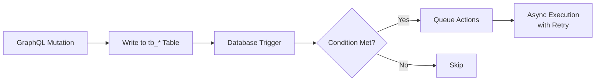
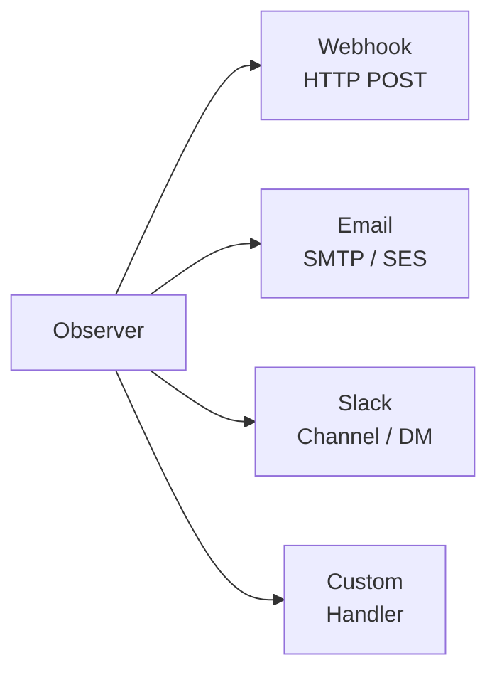

Observers provide **event-driven logic** for your FraiseQL API. They react to database changes and trigger actions like webhooks, emails, or Slack notifications.

## Why Observers?

Traditional approaches to post-mutation logic:
- **Application code**: Business logic scattered across services
- **Database triggers**: Limited to SQL, hard to debug
- **Message queues**: Infrastructure complexity

Observers centralize event-driven logic in your schema:

```python
@observer(
    entity="Order",
    event="INSERT",
    condition="total > 1000",
    actions=[
        slack("#sales", "High-value order: ${total}"),
        email(to="sales@example.com", subject="New order")
    ]
)
def on_high_value_order():
    pass
```

## Observer Anatomy

An observer consists of:

1. **Entity**: The table/type being watched
2. **Event**: INSERT, UPDATE, or DELETE
3. **Condition**: When to trigger (optional)
4. **Actions**: What to do when triggered

```python
from fraiseql import observer, webhook, email, slack

@observer(
    entity="Order",           # Watch tb_order
    event="INSERT",           # On new records
    condition="total > 100",  # Only if total > 100
    actions=[                 # Actions to execute
        webhook("https://api.example.com/orders"),
        slack("#orders", "New order: {id}")
    ]
)
def on_new_order():
    """Triggered when a new order over $100 is created."""
    pass
```

## Events

### INSERT

Triggered when a new record is created:

```python
@observer(
    entity="User",
    event="INSERT",
    actions=[
        email(
            to="{email}",
            subject="Welcome to our platform!",
            body="Hello {name}, thanks for signing up."
        )
    ]
)
def on_user_signup():
    pass
```

### UPDATE

Triggered when a record is modified:

```python
@observer(
    entity="Order",
    event="UPDATE",
    condition="status.changed() and status == 'shipped'",
    actions=[
        email(
            to="{customer_email}",
            subject="Your order {id} has shipped!",
            body="Your order is on its way."
        )
    ]
)
def on_order_shipped():
    pass
```

**Change detection:**
- `field.changed()` — Field value changed
- `field.old` — Previous value
- `field.new` — New value

### DELETE

Triggered when a record is removed:

```python
@observer(
    entity="Order",
    event="DELETE",
    actions=[
        webhook(
            "https://api.example.com/archive",
            body_template='{"type": "order", "id": "{{id}}", "data": {{_json}}}'
        )
    ]
)
def on_order_deleted():
    pass
```

## Conditions

Filter which events trigger the observer:

### Simple Comparisons

```python
condition="total > 1000"
condition="status == 'active'"
condition="is_premium == true"
```

### Change Detection

```python
# Field changed to specific value
condition="status.changed() and status == 'shipped'"

# Field changed from specific value
condition="status.old == 'pending' and status == 'approved'"

# Any change to field
condition="email.changed()"
```

### Complex Logic

```python
# Multiple conditions
condition="total > 1000 and is_premium == true"

# OR conditions
condition="status == 'failed' or retry_count > 3"

# Field comparisons
condition="quantity > min_quantity"
```

## Actions

### Webhook

Send HTTP requests to external services:

```python
from fraiseql import webhook

# Simple webhook
webhook("https://api.example.com/orders")

# With custom headers
webhook(
    "https://api.example.com/orders",
    headers={"Authorization": "Bearer {API_TOKEN}"}
)

# With custom body
webhook(
    "https://api.example.com/orders",
    body_template='{"order_id": "{{id}}", "total": {{total}}}'
)

# URL from environment variable
webhook(url_env="SHIPPING_WEBHOOK_URL")
```

**Template variables:**
- `{field_name}` — Field value
- `{ENV_VAR}` — Environment variable
- `{{field}}` — Mustache-style for JSON templates
- `{{_json}}` — Complete record as JSON

### Email

Send email notifications:

```python
from fraiseql import email

email(
    to="{customer_email}",
    subject="Order {id} confirmed",
    body="Thank you for your order of ${total}.",
    from_email="orders@example.com"
)

# Multiple recipients
email(
    to=["admin@example.com", "{customer_email}"],
    subject="New order",
    body="Order {id} was placed."
)

# HTML body
email(
    to="{email}",
    subject="Welcome!",
    body_html="<h1>Welcome {name}!</h1><p>Thanks for joining.</p>"
)
```

### Slack

Send Slack messages:

```python
from fraiseql import slack

# Simple message
slack("#orders", "New order: {id} for ${total}")

# With formatting
slack(
    "#sales",
    ":moneybag: High-value order {id}: ${total} from {customer_email}"
)

# Direct message
slack(
    "@sales-lead",
    "Urgent: Order {id} requires approval"
)
```

## Retry Configuration

Configure retry behavior for failed actions:

```python
from fraiseql import observer, webhook, RetryConfig

@observer(
    entity="Payment",
    event="UPDATE",
    condition="status == 'failed'",
    actions=[
        webhook("https://api.example.com/payment-failures")
    ],
    retry=RetryConfig(
        max_attempts=5,
        backoff_strategy="exponential",
        initial_delay_ms=100,
        max_delay_ms=60000
    )
)
def on_payment_failure():
    pass
```

**Retry options:**
- `max_attempts`: Maximum retry count (default: 3)
- `backoff_strategy`: `"fixed"`, `"linear"`, or `"exponential"`
- `initial_delay_ms`: First retry delay in milliseconds
- `max_delay_ms`: Maximum delay between retries

## Complete Example

Here's a full e-commerce observer setup:

```python
import fraiseql
from fraiseql import (
    ID, DateTime, email, observer,
    slack, type, webhook, RetryConfig
)

@fraiseql.type
class Order:
    id: ID
    customer_email: str
    status: str
    total: float
    created_at: DateTime

@fraiseql.type
class Payment:
    id: ID
    order_id: ID
    amount: float
    status: str
    processed_at: DateTime | None

# High-value order notifications
@observer(
    entity="Order",
    event="INSERT",
    condition="total > 1000",
    actions=[
        webhook("https://api.example.com/high-value-orders"),
        slack("#sales", ":moneybag: High-value order {id}: ${total}"),
        email(
            to="sales@example.com",
            subject="High-value order {id}",
            body="Order {id} for ${total} was created by {customer_email}"
        )
    ]
)
def on_high_value_order():
    """Triggered when a high-value order is created."""
    pass

# Order shipped notifications
@observer(
    entity="Order",
    event="UPDATE",
    condition="status.changed() and status == 'shipped'",
    actions=[
        webhook(url_env="SHIPPING_WEBHOOK_URL"),
        email(
            to="{customer_email}",
            subject="Your order {id} has shipped!",
            body="Your order is on its way.",
            from_email="noreply@example.com"
        )
    ]
)
def on_order_shipped():
    """Triggered when an order status changes to 'shipped'."""
    pass

# Payment failure handling
@observer(
    entity="Payment",
    event="UPDATE",
    condition="status == 'failed'",
    actions=[
        slack("#payments", ":warning: Payment failed for order {order_id}"),
        webhook(
            "https://api.example.com/payment-failures",
            headers={"Authorization": "Bearer {PAYMENT_API_TOKEN}"}
        )
    ],
    retry=RetryConfig(
        max_attempts=5,
        backoff_strategy="exponential",
        initial_delay_ms=100,
        max_delay_ms=60000
    )
)
def on_payment_failure():
    """Triggered when a payment fails."""
    pass

# Archive deleted orders
@observer(
    entity="Order",
    event="DELETE",
    actions=[
        webhook(
            "https://api.example.com/archive",
            body_template='{"type": "order", "id": "{{id}}", "data": {{_json}}}'
        )
    ]
)
def on_order_deleted():
    """Triggered when an order is deleted."""
    pass
```

## How Observers Work

1. **Compile time**: Observers are compiled into database triggers and action handlers
2. **Write operation**: Mutation modifies `tb_` table
3. **Trigger fires**: Database trigger evaluates condition
4. **Action dispatch**: Matching observers queue their actions
5. **Action execution**: Actions execute asynchronously with retry logic

The pipeline from trigger to execution:

Observer execution pipeline



Each observer can dispatch one or more action types:

Available action types



## Best Practices

### Keep Conditions Simple

Complex conditions are harder to debug. Prefer simple, readable conditions:

```python
# Good
condition="status == 'shipped'"

# Avoid
condition="status == 'shipped' and total > 100 and customer_type == 'premium' and region in ('US', 'CA')"
```

For complex logic, create separate observers or use webhook endpoints that handle the logic.

### Use Environment Variables

Never hardcode secrets or URLs:

```python
# Good
webhook(url_env="WEBHOOK_URL")
webhook(headers={"Authorization": "Bearer {API_TOKEN}"})

# Bad
webhook("https://api.example.com/secret-endpoint")
webhook(headers={"Authorization": "Bearer sk-12345"})
```

### Handle Failures Gracefully

Configure appropriate retry strategies:

```python
# Idempotent actions (safe to retry)
retry=RetryConfig(max_attempts=5, backoff_strategy="exponential")

# Non-idempotent actions (risky to retry)
retry=RetryConfig(max_attempts=1)  # or omit retry
```

### Document Observer Purpose

Use docstrings to explain business logic:

```python
@observer(
    entity="Order",
    event="UPDATE",
    condition="status.changed() and status == 'cancelled'",
    actions=[...]
)
def on_order_cancelled():
    """
    Triggered when an order is cancelled.

    Actions:
    - Notify warehouse to stop processing
    - Send cancellation email to customer
    - Update analytics dashboard

    Business rule: Cancellation is only allowed within 24 hours.
    """
    pass
```

## Next Steps

- [Mutations](/concepts/mutations) — Write operations that trigger observers
- [CQRS Pattern](/concepts/cqrs) — Understanding the data flow
- [Security](/features/security) — Securing observer actions