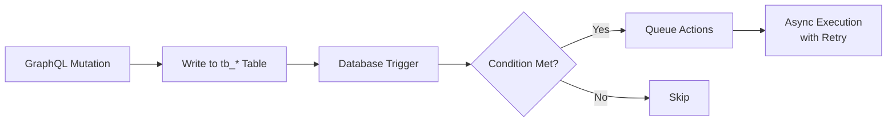
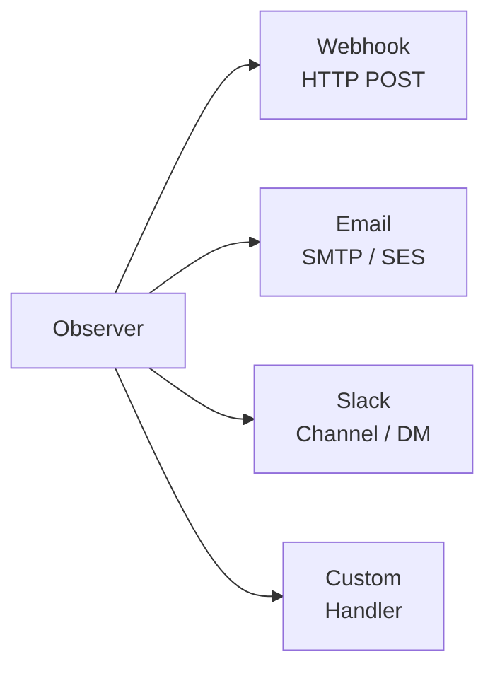

import { Tabs, TabItem, Aside, CardGrid, Card, Steps } from '@astrojs/starlight/components';

Observers provide **event-driven logic** for your FraiseQL API. They react to database changes and trigger actions like webhooks, emails, or Slack notifications.

## Why Observers?

Traditional approaches to post-mutation logic:
- **Application code**: Business logic scattered across services
- **Database triggers**: Limited to SQL, hard to debug
- **Message queues**: Infrastructure complexity

Observers centralize event-driven logic in your schema:

<Tabs syncKey="language">
  <TabItem label="Python">

```python
@observer(
    entity="Order",
    event="INSERT",
    condition="total > 1000",
    actions=[
        slack("#sales", "High-value order: ${total}"),
        email(to="sales@example.com", subject="New order")
    ]
)
def on_high_value_order():
    pass
```

  </TabItem>
  <TabItem label="TypeScript">

```typescript
import { observer, slack, email } from 'fraiseql';

observer({
  entity: 'Order',
  event: 'INSERT',
  condition: 'total > 1000',
  actions: [
    slack('#sales', 'High-value order: ${total}'),
    email({ to: 'sales@example.com', subject: 'New order' }),
  ],
  handler: function onHighValueOrder() {},
});
```

  </TabItem>
</Tabs>

### Observer lifecycle

<Aside type="note">
Observers run **asynchronously by default** — the mutation returns to the client immediately and observer actions fire in the background (fire-and-forget). Add `sync=True` (Python) or `{ sync: true }` (TypeScript) to the observer declaration when you need the action to complete before the response is sent. Use synchronous observers sparingly; they add latency to every matching mutation.
</Aside>

<Aside type="note">
Observer actions use **at-least-once delivery**. Your webhook endpoints and action handlers must be idempotent — the same event may be delivered more than once after crashes or network partitions. Use a unique event ID (available in the webhook payload) to deduplicate. For exactly-once delivery semantics, route events through [NATS JetStream](/features/nats) instead.
</Aside>

<Aside type="note">
In multi-replica deployments, FraiseQL uses a **distributed lease** to ensure only one instance processes each CDC stream at a time. If the active instance crashes, the lease expires and another instance takes over — at-least-once delivery still applies near the handover boundary, but the same event is not processed by all replicas simultaneously. Configuring a Redis backend (`redis_url` in `[observers]`) is required for the distributed lease to work across replicas.
</Aside>

## Observer Anatomy

An observer consists of:

1. **Entity**: The table/type being watched
2. **Event**: INSERT, UPDATE, or DELETE
3. **Condition**: When to trigger (optional)
4. **Actions**: What to do when triggered

<Tabs syncKey="language">
  <TabItem label="Python">

```python
from fraiseql import observer, webhook, email, slack

@observer(
    entity="Order",           # Watch tb_order
    event="INSERT",           # On new records
    condition="total > 100",  # Only if total > 100
    actions=[                 # Actions to execute
        webhook("https://api.example.com/orders"),
        slack("#orders", "New order: {id}")
    ]
)
def on_new_order():
    """Triggered when a new order over $100 is created."""
    pass
```

  </TabItem>
  <TabItem label="TypeScript">

```typescript
import { observer, webhook, slack } from 'fraiseql';

observer({
  entity: 'Order',           // Watch tb_order
  event: 'INSERT',           // On new records
  condition: 'total > 100',  // Only if total > 100
  actions: [                 // Actions to execute
    webhook('https://api.example.com/orders'),
    slack('#orders', 'New order: {id}'),
  ],
  handler: function onNewOrder() {
    // Triggered when a new order over $100 is created.
  },
});
```

  </TabItem>
</Tabs>

## Events

### INSERT

Triggered when a new record is created:

<Tabs syncKey="language">
  <TabItem label="Python">

```python
@observer(
    entity="User",
    event="INSERT",
    actions=[
        email(
            to="{email}",
            subject="Welcome to our platform!",
            body="Hello {name}, thanks for signing up."
        )
    ]
)
def on_user_signup():
    pass
```

  </TabItem>
  <TabItem label="TypeScript">

```typescript
observer({
  entity: 'User',
  event: 'INSERT',
  actions: [
    email({
      to: '{email}',
      subject: 'Welcome to our platform!',
      body: 'Hello {name}, thanks for signing up.',
    }),
  ],
  handler: function onUserSignup() {},
});
```

  </TabItem>
</Tabs>

### UPDATE

Triggered when a record is modified:

<Tabs syncKey="language">
  <TabItem label="Python">

```python
@observer(
    entity="Order",
    event="UPDATE",
    condition="status.changed() and status == 'shipped'",
    actions=[
        email(
            to="{customer_email}",
            subject="Your order {id} has shipped!",
            body="Your order is on its way."
        )
    ]
)
def on_order_shipped():
    pass
```

  </TabItem>
  <TabItem label="TypeScript">

```typescript
observer({
  entity: 'Order',
  event: 'UPDATE',
  condition: "status.changed() and status == 'shipped'",
  actions: [
    email({
      to: '{customer_email}',
      subject: 'Your order {id} has shipped!',
      body: 'Your order is on its way.',
    }),
  ],
  handler: function onOrderShipped() {},
});
```

  </TabItem>
</Tabs>

**Change detection:**
- `field.changed()` — Field value changed
- `field.old` — Previous value
- `field.new` — New value

### DELETE

Triggered when a record is removed:

<Tabs syncKey="language">
  <TabItem label="Python">

```python
@observer(
    entity="Order",
    event="DELETE",
    actions=[
        webhook(
            "https://api.example.com/archive",
            body_template='{"type": "order", "id": "{{id}}", "data": {{_json}}}'
        )
    ]
)
def on_order_deleted():
    pass
```

  </TabItem>
  <TabItem label="TypeScript">

```typescript
observer({
  entity: 'Order',
  event: 'DELETE',
  actions: [
    webhook('https://api.example.com/archive', {
      bodyTemplate: '{"type": "order", "id": "{{id}}", "data": {{_json}}}',
    }),
  ],
  handler: function onOrderDeleted() {},
});
```

  </TabItem>
</Tabs>

## Conditions

Filter which events trigger the observer:

### Simple Comparisons

```python
condition="total > 1000"
condition="status == 'active'"
condition="is_premium == true"
```

### Change Detection

```python
# Field changed to specific value
condition="status.changed() and status == 'shipped'"

# Field changed from specific value
condition="status.old == 'pending' and status == 'approved'"

# Any change to field
condition="email.changed()"
```

### Complex Logic

```python
# Multiple conditions
condition="total > 1000 and is_premium == true"

# OR conditions
condition="status == 'failed' or retry_count > 3"

# Field comparisons
condition="quantity > min_quantity"
```

## Actions

### Webhook

Send HTTP requests to external services:

```python
from fraiseql import webhook

# Simple webhook
webhook("https://api.example.com/orders")

# With custom headers
webhook(
    "https://api.example.com/orders",
    headers={"Authorization": "Bearer {API_TOKEN}"}
)

# With custom body
webhook(
    "https://api.example.com/orders",
    body_template='{"order_id": "{{id}}", "total": {{total}}}'
)

# URL from environment variable
webhook(url_env="SHIPPING_WEBHOOK_URL")
```

**Template variables:**
- `{field_name}` — Field value
- `{ENV_VAR}` — Environment variable
- `{{field}}` — Mustache-style for JSON templates
- `{{_json}}` — Complete record as JSON

#### Webhook payload format

When no `body_template` is specified, FraiseQL sends a standard JSON payload to the webhook URL:

```json
// Webhook payload received by your endpoint
{
  "event": "INSERT",
  "table": "tb_order",
  "timestamp": "2026-02-25T10:00:00Z",
  "data": {
    "new": {
      "id": "order-123",
      "status": "confirmed",
      "total": 99.99,
      "user_id": "user-456"
    },
    "old": null
  }
}
```

For UPDATE events, `"old"` contains the previous field values and `"new"` contains the updated values. For DELETE events, `"new"` is `null` and `"old"` contains the deleted record. The `"timestamp"` field is a stable event ID you can use for deduplication.

### Email

Send email notifications:

```python
from fraiseql import email

email(
    to="{customer_email}",
    subject="Order {id} confirmed",
    body="Thank you for your order of ${total}.",
    from_email="orders@example.com"
)

# Multiple recipients
email(
    to=["admin@example.com", "{customer_email}"],
    subject="New order",
    body="Order {id} was placed."
)

# HTML body
email(
    to="{email}",
    subject="Welcome!",
    body_html="<h1>Welcome {name}!</h1><p>Thanks for joining.</p>"
)
```

### Slack

Send Slack messages:

```python
from fraiseql import slack

# Simple message
slack("#orders", "New order: {id} for ${total}")

# With formatting
slack(
    "#sales",
    ":moneybag: High-value order {id}: ${total} from {customer_email}"
)

# Direct message
slack(
    "@sales-lead",
    "Urgent: Order {id} requires approval"
)
```

## Retry Configuration

Configure retry behavior for failed actions:

```python
from fraiseql import observer, webhook, RetryConfig

@observer(
    entity="Payment",
    event="UPDATE",
    condition="status == 'failed'",
    actions=[
        webhook("https://api.example.com/payment-failures")
    ],
    retry=RetryConfig(
        max_attempts=5,
        backoff_strategy="exponential",
        initial_delay_ms=100,
        max_delay_ms=60000
    )
)
def on_payment_failure():
    pass
```

**Retry options:**
- `max_attempts`: Maximum retry count (default: 3)
- `backoff_strategy`: `"fixed"`, `"linear"`, or `"exponential"`
- `initial_delay_ms`: First retry delay in milliseconds
- `max_delay_ms`: Maximum delay between retries

## Complete Example

Here's a full e-commerce observer setup:

<Tabs syncKey="language">
  <TabItem label="Python">

```python
import fraiseql
from fraiseql import (
    ID, DateTime, email, observer,
    slack, type, webhook, RetryConfig
)

@fraiseql.type
class Order:
    id: ID
    customer_email: str
    status: str
    total: float
    created_at: DateTime

@fraiseql.type
class Payment:
    id: ID
    order_id: ID
    amount: float
    status: str
    processed_at: DateTime | None

# High-value order notifications
@observer(
    entity="Order",
    event="INSERT",
    condition="total > 1000",
    actions=[
        webhook("https://api.example.com/high-value-orders"),
        slack("#sales", ":moneybag: High-value order {id}: ${total}"),
        email(
            to="sales@example.com",
            subject="High-value order {id}",
            body="Order {id} for ${total} was created by {customer_email}"
        )
    ]
)
def on_high_value_order():
    """Triggered when a high-value order is created."""
    pass

# Order shipped notifications
@observer(
    entity="Order",
    event="UPDATE",
    condition="status.changed() and status == 'shipped'",
    actions=[
        webhook(url_env="SHIPPING_WEBHOOK_URL"),
        email(
            to="{customer_email}",
            subject="Your order {id} has shipped!",
            body="Your order is on its way.",
            from_email="noreply@example.com"
        )
    ]
)
def on_order_shipped():
    """Triggered when an order status changes to 'shipped'."""
    pass

# Payment failure handling
@observer(
    entity="Payment",
    event="UPDATE",
    condition="status == 'failed'",
    actions=[
        slack("#payments", ":warning: Payment failed for order {order_id}"),
        webhook(
            "https://api.example.com/payment-failures",
            headers={"Authorization": "Bearer {PAYMENT_API_TOKEN}"}
        )
    ],
    retry=RetryConfig(
        max_attempts=5,
        backoff_strategy="exponential",
        initial_delay_ms=100,
        max_delay_ms=60000
    )
)
def on_payment_failure():
    """Triggered when a payment fails."""
    pass

# Archive deleted orders
@observer(
    entity="Order",
    event="DELETE",
    actions=[
        webhook(
            "https://api.example.com/archive",
            body_template='{"type": "order", "id": "{{id}}", "data": {{_json}}}'
        )
    ]
)
def on_order_deleted():
    """Triggered when an order is deleted."""
    pass
```

  </TabItem>
  <TabItem label="TypeScript">

```typescript
import { type, observer, webhook, email, slack, RetryConfig } from 'fraiseql';

@type()
class Order {
  id: string;
  customerEmail: string;
  status: string;
  total: number;
  createdAt: Date;
}

@type()
class Payment {
  id: string;
  orderId: string;
  amount: number;
  status: string;
  processedAt: Date | null;
}

// High-value order notifications
observer({
  entity: 'Order',
  event: 'INSERT',
  condition: 'total > 1000',
  actions: [
    webhook('https://api.example.com/high-value-orders'),
    slack('#sales', ':moneybag: High-value order {id}: ${total}'),
    email({
      to: 'sales@example.com',
      subject: 'High-value order {id}',
      body: 'Order {id} for ${total} was created by {customer_email}',
    }),
  ],
  handler: function onHighValueOrder() {},
});

// Order shipped notifications
observer({
  entity: 'Order',
  event: 'UPDATE',
  condition: "status.changed() and status == 'shipped'",
  actions: [
    webhook({ urlEnv: 'SHIPPING_WEBHOOK_URL' }),
    email({
      to: '{customer_email}',
      subject: 'Your order {id} has shipped!',
      body: 'Your order is on its way.',
      fromEmail: 'noreply@example.com',
    }),
  ],
  handler: function onOrderShipped() {},
});

// Payment failure handling
observer({
  entity: 'Payment',
  event: 'UPDATE',
  condition: "status == 'failed'",
  actions: [
    slack('#payments', ':warning: Payment failed for order {order_id}'),
    webhook('https://api.example.com/payment-failures', {
      headers: { Authorization: 'Bearer {PAYMENT_API_TOKEN}' },
    }),
  ],
  retry: new RetryConfig({
    maxAttempts: 5,
    backoffStrategy: 'exponential',
    initialDelayMs: 100,
    maxDelayMs: 60000,
  }),
  handler: function onPaymentFailure() {},
});

// Archive deleted orders
observer({
  entity: 'Order',
  event: 'DELETE',
  actions: [
    webhook('https://api.example.com/archive', {
      bodyTemplate: '{"type": "order", "id": "{{id}}", "data": {{_json}}}',
    }),
  ],
  handler: function onOrderDeleted() {},
});
```

  </TabItem>
</Tabs>

## Observer Log Output

When `LOG_LEVEL=debug` is set, FraiseQL prints each observer invocation to stdout. Here is what firing the high-value order observer looks like:

```
[observer] on_high_value_order fired: Order{id=ord_123, total=1250.00}
[observer] Sending Slack notification to #sales
[observer] Slack notification delivered (channel=#sales, ts=1710509048.123456)
[observer] Sending email to sales@example.com
[observer] Email delivered (message_id=<msg_01HV3K@mail.fraiseql.io>)
[observer] on_high_value_order completed in 287ms
```

If an action fails, the log includes the error and retry schedule:

```
[observer] on_high_value_order fired: Order{id=ord_124, total=2400.00}
[observer] Sending Slack notification to #sales
[observer] Slack notification failed: connection timeout (attempt 1/3)
[observer] Retrying in 200ms (exponential backoff)
[observer] Slack notification delivered on attempt 2
```

## How Observers Work

1. **Compile time**: Observers are compiled into database triggers and action handlers
2. **Write operation**: Mutation modifies `tb_` table
3. **Trigger fires**: Database trigger evaluates condition
4. **Action dispatch**: Matching observers queue their actions
5. **Action execution**: Actions execute asynchronously with retry logic

When multiple observers match the same event (same entity and event type), they execute in **definition order** — top-to-bottom as they appear in your schema file. This is deterministic and stable across deployments.

The pipeline from trigger to execution:

Observer execution pipeline



Each observer can dispatch one or more action types:

Available action types



## Best Practices

### Keep Conditions Simple

Complex conditions are harder to debug. Prefer simple, readable conditions:

```python
# Good
condition="status == 'shipped'"

# Avoid
condition="status == 'shipped' and total > 100 and customer_type == 'premium' and region in ('US', 'CA')"
```

For complex logic, create separate observers or use webhook endpoints that handle the logic.

### Use Environment Variables

Never hardcode secrets or URLs:

```python
# Good
webhook(url_env="WEBHOOK_URL")
webhook(headers={"Authorization": "Bearer {API_TOKEN}"})

# Bad
webhook("https://api.example.com/secret-endpoint")
webhook(headers={"Authorization": "Bearer sk-12345"})
```

### Handle Failures Gracefully

Configure appropriate retry strategies:

```python
# Idempotent actions (safe to retry)
retry=RetryConfig(max_attempts=5, backoff_strategy="exponential")

# Non-idempotent actions (risky to retry)
retry=RetryConfig(max_attempts=1)  # or omit retry
```

### Document Observer Purpose

Use docstrings to explain business logic:

```python
@observer(
    entity="Order",
    event="UPDATE",
    condition="status.changed() and status == 'cancelled'",
    actions=[...]
)
def on_order_cancelled():
    """
    Triggered when an order is cancelled.

    Actions:
    - Notify warehouse to stop processing
    - Send cancellation email to customer
    - Update analytics dashboard

    Business rule: Cancellation is only allowed within 24 hours.
    """
    pass
```

## Verify It Works

<Steps>

1. **Define an observer in your schema**:
   ```python
   @observer(
       entity="User",
       event="INSERT",
       actions=[
           webhook("http://localhost:3001/webhook")
       ]
   )
   def on_user_signup():
       """Triggered when a new user signs up."""
       pass
   ```

2. **Start a test webhook server** (in another terminal):
   ```bash
   # Using Python for quick testing
   python3 -m http.server 3001 &
   ```

3. **Create a user to trigger the observer**:
   ```bash
   curl -X POST http://localhost:8080/graphql \
     -H "Content-Type: application/json" \
     -H "Authorization: Bearer $TOKEN" \
     -d '{
       "query": "mutation { createUser(input: { name: \"Test User\", email: \"test@example.com\" }) { id } }"
     }'
   ```

4. **Check webhook was received**:
   ```bash
   # The webhook payload should appear in the http.server output:
   # {"event": "INSERT", "table": "tb_user", "timestamp": "2024-01-15T10:30:00Z", "data": {"new": {...}}}
   ```

5. **Check observer logs** (if `LOG_LEVEL=debug` is set):
   ```
   [observer] on_user_signup fired: User{id=usr_abc123, name="Test User"}
   [observer] Sending webhook to http://localhost:3001/webhook
   [observer] Webhook delivered (status=200)
   ```

6. **Test with conditions**:
   ```python
   @observer(
       entity="Order",
       event="INSERT",
       condition="total > 100",
       actions=[slack("#sales", "High-value order: {id}")]
   )
   def on_high_value_order():
       pass
   ```
   
   Create a small order (should NOT trigger):
   ```bash
   curl -X POST http://localhost:8080/graphql \
     -d '{"query": "mutation { createOrder(input: { total: 50 }) { id } }"}'
   ```
   
   Create a large order (SHOULD trigger):
   ```bash
   curl -X POST http://localhost:8080/graphql \
     -d '{"query": "mutation { createOrder(input: { total: 150 }) { id } }"}'
   ```

</Steps>

## Troubleshooting

### Observer Not Firing

1. **Check entity name** matches the table name (case-sensitive):
   ```python
   entity="Order"  # Matches tb_order
   ```

2. **Verify the mutation actually modifies the table**:
   - Observers only fire on INSERT/UPDATE/DELETE
   - Read queries (SELECT) do not trigger observers

3. **Check condition syntax**:
   ```python
   # Valid
   condition="total > 100"
   
   # Invalid (no spaces around operator)
   condition="total>100"
   ```

4. **Enable debug logging**:
   ```bash
   LOG_LEVEL=debug fraiseql run
   ```

### Webhook Not Received

1. **Test the webhook endpoint directly**:
   ```bash
   curl -X POST http://your-webhook-url \
     -H "Content-Type: application/json" \
     -d '{"test": true}'
   ```

2. **Check network connectivity** from FraiseQL server:
   ```bash
   # On the FraiseQL server
   curl -v http://your-webhook-url
   ```

3. **Review retry logs**:
   ```
   [observer] Webhook failed: connection timeout (attempt 1/3)
   [observer] Retrying in 200ms
   ```

### Performance Issues

If observers slow down mutations:

1. **Use async execution** (default):
   ```python
   @observer(
       entity="Order",
       event="INSERT",
       sync=False  # Fire-and-forget
   )
   ```

2. **Reduce action count** per observer

3. **Move heavy processing to background jobs** via NATS

## Next Steps

<CardGrid>
  <Card title="Mutations" icon="pencil">
    [Write operations that trigger observers](/concepts/mutations)
  </Card>
  <Card title="NATS Integration" icon="random">
    [Route events through NATS JetStream for exactly-once delivery](/features/nats)
  </Card>
  <Card title="Security" icon="shield">
    [Secure observer webhook endpoints](/features/security)
  </Card>
</CardGrid>