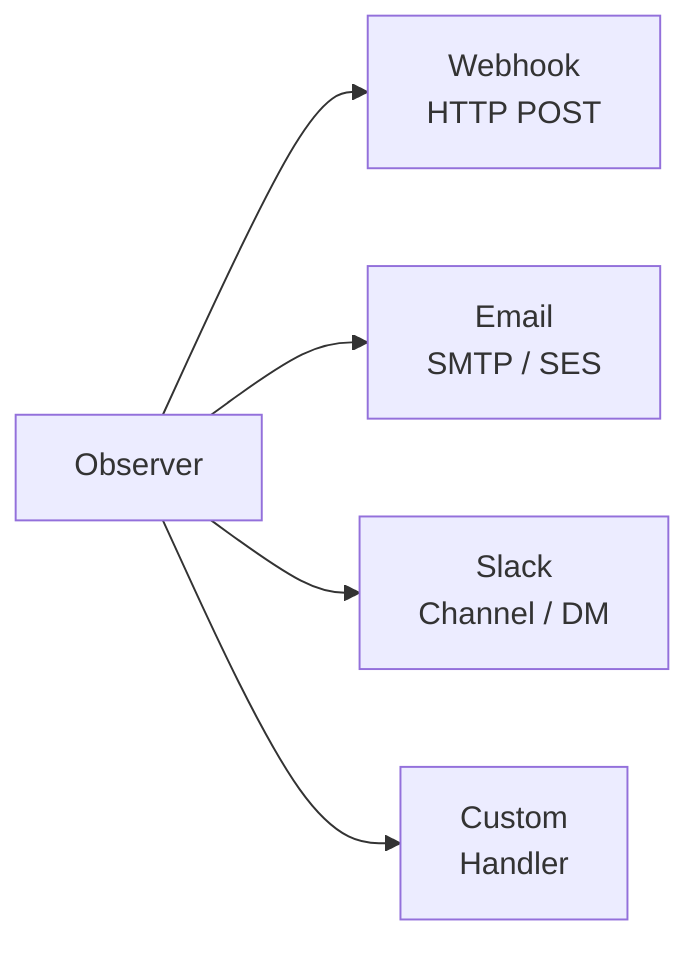

import { Tabs, TabItem, Aside, CardGrid, Card, Steps } from '@astrojs/starlight/components';

Observers provide **event-driven logic** for your FraiseQL API. They react to database changes and trigger actions like webhooks, emails, or Slack notifications.

<Aside type="caution">
**Observer configuration is TOML-only.** The Python `@observer`, `webhook()`, `email()`, `slack()`, and `RetryConfig` APIs shown in older examples do not exist in the `fraiseql` Python package. Observers are configured entirely via `fraiseql.toml` and the Rust server. The Python package is for schema definition only.
</Aside>

## Why Observers?

Traditional approaches to post-mutation logic:
- **Application code**: Business logic scattered across services
- **Database triggers**: Limited to SQL, hard to debug
- **Message queues**: Infrastructure complexity

Observers centralize event-driven logic in your `fraiseql.toml` configuration:

```toml
# fraiseql.toml — configure observer backend
[observers]
backend   = "redis"      # "in-memory" | "postgres" | "redis" | "nats"
redis_url = "${REDIS_URL}"
# nats_url = "${NATS_URL}"
```

Observer actions (webhooks, Slack) are wired up in your schema configuration. See the sections below for each action type.

### Observer lifecycle

<Aside type="note">
Observers run **asynchronously by default** — the mutation returns to the client immediately and observer actions fire in the background (fire-and-forget). Add `sync=True` (Python) or `{ sync: true }` (TypeScript) to the observer declaration when you need the action to complete before the response is sent. Use synchronous observers sparingly; they add latency to every matching mutation.
</Aside>

<Aside type="note">
Observer actions use **at-least-once delivery**. Your webhook endpoints and action handlers must be idempotent — the same event may be delivered more than once after crashes or network partitions. Use a unique event ID (available in the webhook payload) to deduplicate. For exactly-once delivery semantics, route events through [NATS JetStream](/features/nats) instead.
</Aside>

<Aside type="note">
In multi-replica deployments, FraiseQL uses a **distributed lease** to ensure only one instance processes each CDC stream at a time. If the active instance crashes, the lease expires and another instance takes over — at-least-once delivery still applies near the handover boundary, but the same event is not processed by all replicas simultaneously. The lease backend is selected from `[observers]`: `postgres` uses a PostgreSQL session advisory lock (no extra infrastructure), `redis` uses an atomic TTL-based lock. The default in-process backend does not coordinate across replicas.
</Aside>

## Observer Anatomy

An observer consists of:

1. **Entity**: The table/type being watched
2. **Event**: INSERT, UPDATE, or DELETE
3. **Condition**: When to trigger (optional Elo expression)
4. **Actions**: What to do when triggered (webhook, Slack)

Observers are configured in `fraiseql.toml`. Database change events are delivered via PostgreSQL `LISTEN`/`NOTIFY` — the FraiseQL server registers listeners at startup and routes each event to matching observers.

```toml
# Example observer configuration in fraiseql.toml
[observers]
backend   = "redis"
redis_url = "${REDIS_URL}"
```

Each observer action (webhook, Slack) is registered in your schema configuration file alongside your type definitions. The condition uses the same Elo expression syntax as custom scalar validation (see [Elo Validation Language](/concepts/elo-validation)).

## Events

FraiseQL observers react to three event types, delivered via PostgreSQL `LISTEN`/`NOTIFY`:

### INSERT

Triggered when a new record is created. The event payload contains the new record's data.

```
Entity: User
Event:  INSERT
→ Delivers new user data to configured webhook/Slack actions
```

### UPDATE

Triggered when a record is modified. The condition can use `field.changed()` syntax to filter on specific field transitions:

```
Condition: status.changed() && status == 'shipped'
→ Fires only when the status field transitions to 'shipped'
```

**Change detection in conditions:**
- `field.changed()` — True if the field value changed in this event
- `field.old` — Previous value (available in condition context for UPDATE events)
- `field.new` — New value (same as `field` in condition context)

### DELETE

Triggered when a record is removed. The event payload contains the deleted record's data.

## Conditions

Conditions filter which events trigger an observer. They use the Elo expression language with `&&` (AND) and `||` (OR) logical operators:

### Simple Comparisons

```text
total > 1000
status == 'active'
is_premium == true
```

### Change Detection

```text
# Field changed to specific value
status.changed() && status == 'shipped'

# Field changed from specific value
status.old == 'pending' && status == 'approved'

# Any change to field
email.changed()
```

### Complex Logic

```text
# Multiple conditions
total > 1000 && is_premium == true

# OR conditions
status == 'failed' || retry_count > 3

# Field comparisons
quantity > min_quantity
```

## Actions

### Webhook

The webhook action sends an HTTP POST to a configured URL. It supports custom headers and Mustache-style body templates:

**Template variables:**
- `{{field_name}}` — Mustache-style field substitution in body templates
- `{{_json}}` — Complete record as JSON

**Supported configuration:**
- `url` — Hardcoded URL
- `url_env` — URL from environment variable (preferred for secrets)
- `headers` — Custom HTTP headers (use env var references for tokens)
- `body_template` — Mustache template; if omitted, the raw event data is sent

#### Webhook payload format

When no `body_template` is specified, FraiseQL sends a standard JSON payload to the webhook URL:

```json
// Webhook payload received by your endpoint
{
  "event": "INSERT",
  "table": "tb_order",
  "timestamp": "2026-02-25T10:00:00Z",
  "data": {
    "new": {
      "id": "order-123",
      "status": "confirmed",
      "total": 99.99,
      "user_id": "user-456"
    },
    "old": null
  }
}
```

For UPDATE events, `"old"` contains the previous field values and `"new"` contains the updated values. For DELETE events, `"new"` is `null` and `"old"` contains the deleted record. The `"timestamp"` field is a stable event ID you can use for deduplication.

### Email

<Aside type="caution">
The email action is **not yet implemented**. The current Rust implementation (`EmailAction.execute()`) is a stub that always returns success without sending any email. Do not use the email action in production. Route email notifications through a webhook to your email provider instead.
</Aside>

The email action is planned for a future release. For now, use a webhook action pointing to your email service's API (SendGrid, Resend, Postmark, etc.).

### Slack

The Slack action sends a message to a Slack webhook URL. Configure the webhook URL via an environment variable and specify the message template:

**Supported configuration:**
- `webhook_url` or `webhook_url_env` — Slack incoming webhook URL
- `channel` — Slack channel (`#channel-name`)
- `message` — Message text with `{field_name}` substitution

Messages support standard Slack formatting (`:emoji:`, `*bold*`, `_italic_`).

## Retry Configuration

The observer system uses **at-least-once delivery**. When a webhook action fails (non-2xx response or network error), it is retried with backoff. Retry behavior is configured per-observer in your schema configuration:

**Retry options:**
- `max_attempts`: Maximum retry count (default: 3)
- `backoff_strategy`: `"fixed"`, `"linear"`, or `"exponential"`
- `initial_delay_ms`: First retry delay in milliseconds
- `max_delay_ms`: Maximum delay between retries

Because delivery is at-least-once, your webhook endpoints should be **idempotent** — the same event may arrive more than once after a crash or network partition. Use the event's unique ID from the payload for deduplication.

### Dead-Letter Queue (DLQ) cap

Events that exhaust all retry attempts are moved to the dead-letter queue for manual inspection. By default the DLQ is unbounded. In long-running deployments where failures are sustained (e.g. a downstream webhook is down for hours), the DLQ can grow large.

Set `max_dlq_size` in `[observers]` to cap it:

```toml
[observers]
backend      = "redis"
redis_url    = "${REDIS_URL}"
max_dlq_size = 1000   # drop newest entry + emit metric when cap reached
```

When the cap is reached, the **newest** incoming DLQ entry is dropped (the oldest entries are preserved for inspection) and the `fraiseql_observer_dlq_overflow_total` counter increments. Alert on that counter to detect sustained downstream failures.

<Aside type="caution">
`max_dlq_size = 0` is rejected at startup — use `null` / omit the field to keep the DLQ unbounded.
</Aside>

For complete configuration reference including sizing parameters, see
[TOML Configuration: \[observers\]](/reference/toml-config#observers).

## Complete Example

Here is an e-commerce observer setup showing the TOML configuration and corresponding Python schema types:

**`fraiseql.toml`** — configure the observer backend:

```toml
[observers]
backend   = "redis"
redis_url = "${REDIS_URL}"
```

**`schema.py`** — define the GraphQL types (observer actions are wired separately in schema configuration):

```python
import fraiseql
from fraiseql.scalars import ID, DateTime

@fraiseql.type
class Order:
    id: ID
    customer_email: str
    status: str
    total: float
    created_at: DateTime

@fraiseql.type
class Payment:
    id: ID
    order_id: ID
    amount: float
    status: str
    processed_at: DateTime | None
```

The observer actions (high-value order webhook, order-shipped Slack message, payment-failed webhook) are registered via your schema configuration file alongside your type definitions. Each observer maps an entity + event + condition to one or more webhook or Slack actions.

## Delivery Guarantees and CheckpointStrategy

The observer system uses **at-least-once delivery** by default — the same event may be dispatched more than once after a crash or restart. For most side effects (sending a notification, calling a webhook) this is acceptable because the action is idempotent or the duplicate is harmless.

| Strategy | Behaviour | Use when |
|----------|-----------|----------|
| `AtLeastOnce` (default) | Event may be processed more than once | Action is idempotent (update a read model, send a metric, post to Slack) |
| `EffectivelyOnce` | Deduplication via an idempotency table | Action must not execute twice (charge a card, send an email, credit an account) |

### AtLeastOnce (default)

No configuration needed. Observers that send Slack notifications, update read models, or fire webhooks that are idempotent by design use this strategy:

```python
# AtLeastOnce — default, no extra configuration
@fraiseql.subscription(
    entity_type="Order",
    topic="order.created",
    operation="create"
)
def notify_fulfillment(order: Order) -> None:
    """Notifies the fulfillment system. Webhook is idempotent."""
    pass
```

### EffectivelyOnce

For non-idempotent actions, configure an idempotency table. FraiseQL records a row before executing the action; duplicate events are detected and skipped via `ON CONFLICT DO NOTHING`:

```python
# EffectivelyOnce — deduplication via idempotency table
@fraiseql.subscription(
    entity_type="Order",
    topic="order.created",
    operation="create",
    checkpoint=fraiseql.EffectivelyOnce(
        idempotency_table="billing_observer_keys"
    )
)
def charge_customer(order: Order) -> None:
    """Charges the customer. Must not execute twice."""
    pass
```

The idempotency table is created automatically on first startup if it does not exist. Its schema:

```sql
CREATE TABLE billing_observer_keys (
    listener_id  TEXT        NOT NULL,
    event_key    TEXT        NOT NULL,
    processed_at TIMESTAMPTZ NOT NULL DEFAULT now(),
    PRIMARY KEY (listener_id, event_key)
);
```

Old rows accumulate over time and must be pruned by a cleanup job. See the [observer idempotency operational guide](/operations/observer-idempotency) for recommended cleanup strategies and retention policies.

### Rust API

`CheckpointStrategy` is also available directly from the `fraiseql_observers` crate for embedding FraiseQL observers in a custom Rust application:

```rust
use fraiseql_observers::{CheckpointStrategy, ListenerConfig};

// Default: fast, no deduplication
let strategy = CheckpointStrategy::AtLeastOnce;

// Effectively-once: records an idempotency key before processing
let strategy = CheckpointStrategy::EffectivelyOnce {
    idempotency_table: "fraiseql_observer_idempotency".to_string(),
};
```

| Method | Description |
|--------|-------------|
| `is_duplicate(pool, listener_id, key)` | Returns `true` if this event has already been processed |
| `record_idempotency_key(pool, listener_id, key)` | Marks the event as processed (call before dispatching the action) |

## Observer Log Output

When `RUST_LOG=debug` is set, FraiseQL prints each observer invocation to stdout. Here is what firing the high-value order observer looks like:

```
[observer] on_high_value_order fired: Order{id=ord_123, total=1250.00}
[observer] Sending Slack notification to #sales
[observer] Slack notification delivered (channel=#sales, ts=1710509048.123456)
[observer] on_high_value_order completed in 287ms
```

<Aside type="caution">
The email action (`EmailAction`) is **not yet implemented** — the current Rust implementation is a stub that always returns success without sending any email. Route email notifications through a webhook action pointing to your email provider's API (SendGrid, Resend, Postmark, etc.) instead.
</Aside>

If an action fails, the log includes the error and retry schedule:

```
[observer] on_high_value_order fired: Order{id=ord_124, total=2400.00}
[observer] Sending Slack notification to #sales
[observer] Slack notification failed: connection timeout (attempt 1/3)
[observer] Retrying in 200ms (exponential backoff)
[observer] Slack notification delivered on attempt 2
```

## How Observers Work

1. **Server startup**: FraiseQL registers PostgreSQL `LISTEN` listeners for database change events (not database triggers)
2. **Write operation**: Mutation modifies a `tb_` table and emits a `pg_notify('fraiseql_changes', ...)` notification
3. **Event received**: The FraiseQL server receives the notification via its LISTEN connection
4. **Condition evaluation**: The observer's Elo condition is evaluated against the event data
5. **Action dispatch**: Matching observers queue their actions for execution
6. **Action execution**: Actions execute asynchronously with retry logic

When multiple observers match the same event (same entity and event type), they execute in **definition order** — top-to-bottom as they appear in your schema file. This is deterministic and stable across deployments.

The pipeline from trigger to execution:

Observer execution pipeline

```mermaid
graph LR
    A[GraphQL Mutation] --> B[Write to tb_* Table]
    B --> C[pg_notify&#40;fraiseql_changes&#41;]
    C --> D{Condition Met?}
    D -->|Yes| E[Queue Actions]
    D -->|No| F[Skip]
    E --> G[Async Execution<br/>with Retry]
```



Each observer can dispatch one or more action types:

Available action types



## Best Practices

### Keep Conditions Simple

Complex conditions are harder to debug. Prefer simple, readable conditions:

```text
# Good
status == 'shipped'

# Avoid — hard to read and debug
status == 'shipped' && total > 100 && customer_type == 'premium'
```

For complex logic, create separate observers or use webhook endpoints that handle the routing logic.

### Use Environment Variables

Never hardcode secrets or URLs in your configuration. Reference environment variables in webhook URL and header settings:

```text
url_env = "WEBHOOK_URL"               # URL from environment variable
headers.Authorization = "${API_TOKEN}" # Token from environment variable
```

### Handle Failures Gracefully

Configure retry strategies based on whether your action is idempotent:

- **Idempotent webhook** (safe to retry): `max_attempts = 5`, `backoff_strategy = "exponential"`
- **Non-idempotent** (charge a card, send an SMS): `max_attempts = 1` to avoid duplicates

## Verify It Works

<Steps>

1. **Configure the observer backend in `fraiseql.toml`**:
   ```toml
   [observers]
   backend = "in-memory"  # Use in-memory for local testing
   ```

2. **Start a test webhook server** (in another terminal):
   ```bash
   # Using Python for quick testing
   python3 -m http.server 3001 &
   ```

3. **Create a user to trigger the observer**:
   ```bash
   curl -X POST http://localhost:8080/graphql \
     -H "Content-Type: application/json" \
     -H "Authorization: Bearer $TOKEN" \
     -d '{
       "query": "mutation { createUser(input: { name: \"Test User\", email: \"test@example.com\" }) { id } }"
     }'
   ```

4. **Check webhook was received**:
   ```bash
   # The webhook payload should appear in the http.server output:
   # {"event": "INSERT", "table": "tb_user", "timestamp": "2024-01-15T10:30:00Z", "data": {"new": {...}}}
   ```

5. **Check observer logs** (if `RUST_LOG=debug` is set):
   ```
   [observer] User INSERT event received: id=550e8400-e29b-41d4-a716-446655440000
   [observer] Sending webhook to http://localhost:3001/webhook
   [observer] Webhook delivered (status=200)
   ```

6. **Test with conditions**: Configure an observer with `condition = "total > 100"` and verify that low-value orders do not trigger it.

</Steps>

## Troubleshooting

### Observer Not Firing

1. **Check entity name** matches the table name (case-sensitive):
   ```python
   entity="Order"  # Matches tb_order
   ```

2. **Verify the mutation actually modifies the table**:
   - Observers only fire on INSERT/UPDATE/DELETE
   - Read queries (SELECT) do not trigger observers

3. **Check condition syntax**:
   ```python
   # Valid
   condition="total > 100"
   
   # Invalid (no spaces around operator)
   condition="total>100"
   ```

4. **Enable debug logging**:
   ```bash
   RUST_LOG=debug fraiseql run
   ```

### Webhook Not Received

1. **Test the webhook endpoint directly**:
   ```bash
   curl -X POST http://your-webhook-url \
     -H "Content-Type: application/json" \
     -d '{"test": true}'
   ```

2. **Check network connectivity** from FraiseQL server:
   ```bash
   # On the FraiseQL server
   curl -v http://your-webhook-url
   ```

3. **Review retry logs**:
   ```
   [observer] Webhook failed: connection timeout (attempt 1/3)
   [observer] Retrying in 200ms
   ```

### Performance Issues

If observers slow down mutations:

1. **Use async execution** (default) — observers fire after the mutation response is sent, not before

2. **Reduce action count** per observer — each action (webhook, Slack) adds latency

3. **Move heavy processing to background jobs** via NATS JetStream

## Next Steps

<CardGrid>
  <Card title="Mutations" icon="pencil">
    [Write operations that trigger observers](/concepts/mutations)
  </Card>
  <Card title="NATS Integration" icon="random">
    [Route events through NATS JetStream for exactly-once delivery](/features/nats)
  </Card>
  <Card title="Security" icon="shield">
    [Secure observer webhook endpoints](/features/security)
  </Card>
</CardGrid>