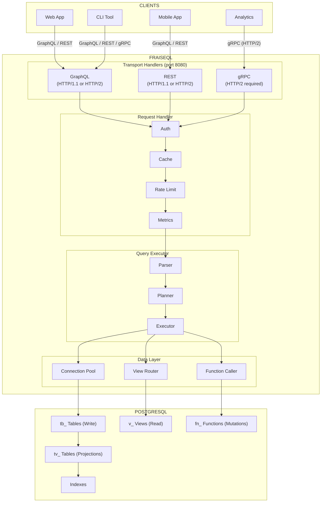
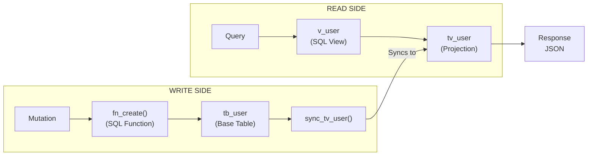
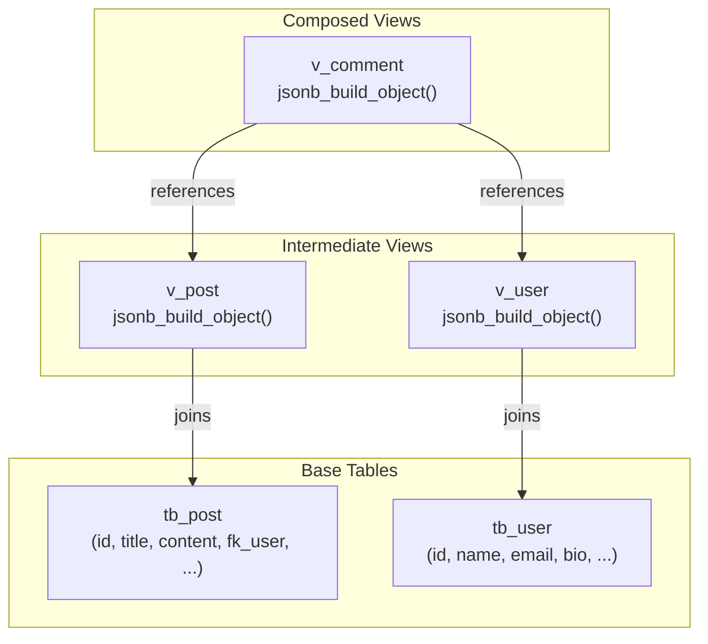
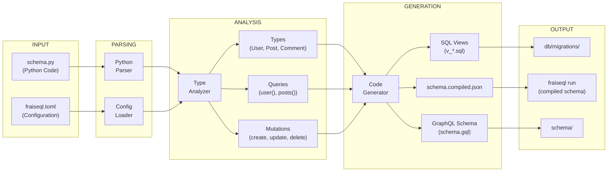
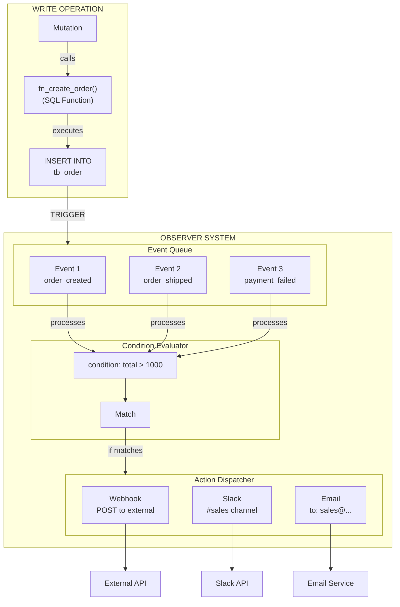
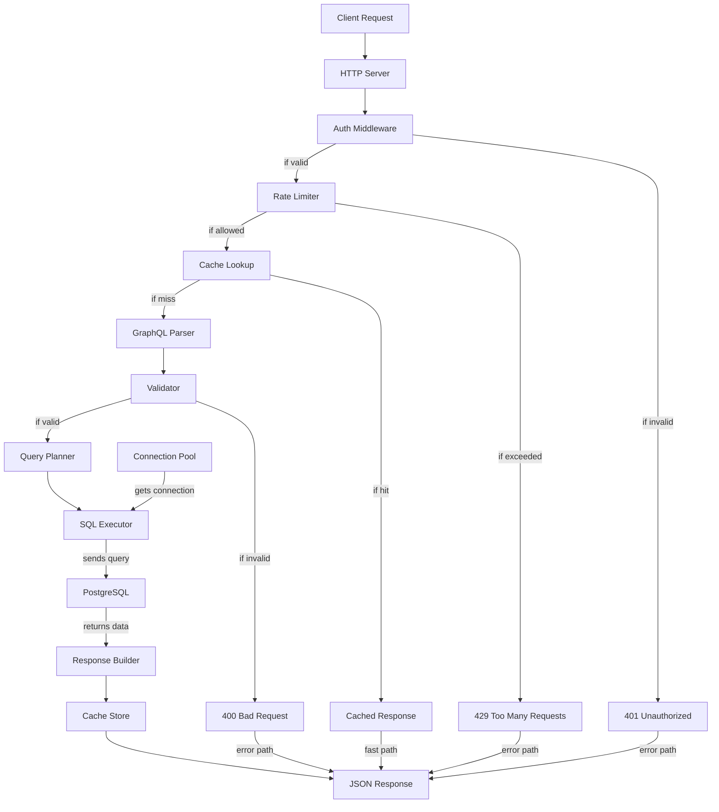

import { CardGrid, Card } from '@astrojs/starlight/components';

Visual representations of FraiseQL's architecture, data flow, and component interactions.

## System Overview

## CQRS Data Flow

## View Composition

## Compilation Pipeline

## Observer Event Flow

## Request Lifecycle

<CardGrid>
  <Card title="How It Works" icon="open-book">
    [Detailed explanation of FraiseQL](/concepts/how-it-works)
  </Card>
  <Card title="CQRS Pattern" icon="open-book">
    [Data architecture and CQRS](/concepts/cqrs)
  </Card>
  <Card title="View Composition" icon="open-book">
    [How views compose into entities](/concepts/view-composition)
  </Card>
</CardGrid>
