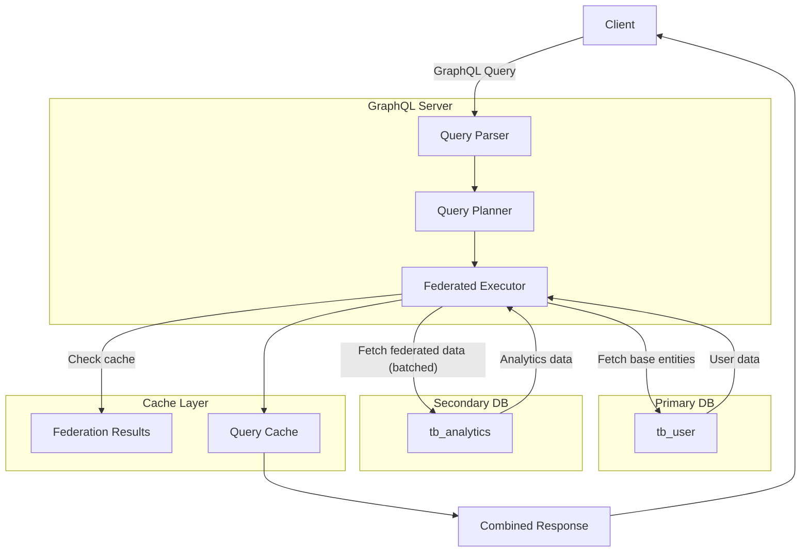

import { Tabs, TabItem, Aside, CardGrid, Card } from '@astrojs/starlight/components';

Advanced federation patterns for building scalable, distributed systems with FraiseQL.

## Federation Architecture Deep Dive

### Federated Query Execution Flow



### Database Heterogeneity

FraiseQL supports federation across different database types:

#### Mixed Database Configuration

```toml
[databases.primary]
type = "postgresql"
url = "${PRIMARY_DB_URL}"
pool_max = 50

[databases.warehouse]
type = "snowflake"
url = "${SNOWFLAKE_URL}"
pool_max = 20

[databases.cache_store]
type = "redis"
url = "${REDIS_URL}"
pool_max = 10

[databases.legacy]
type = "mysql"
url = "${LEGACY_DB_URL}"
pool_max = 15
```

#### Type Mapping Across Databases

```python
import fraiseql
from fraiseql.scalars import ID, DateTime, Decimal

@fraiseql.type(database="primary")
class Order:
    """PostgreSQL primary database."""
    id: ID
    user_id: ID
    total: Decimal
    created_at: DateTime

@fraiseql.type(database="warehouse")
class OrderMetrics:
    """Snowflake data warehouse."""
    order_id: ID
    gross_revenue: Decimal
    cost_of_goods: Decimal
    profit_margin: float

@fraiseql.type(database="legacy")
class LegacyOrder:
    """MySQL legacy system."""
    order_id: str  # String ID in legacy
    total_amount: Decimal
    order_date: DateTime

@fraiseql.type(database="primary")
class OrderFederated:
    """Composed view across databases."""
    id: ID
    total: Decimal

    # PostgreSQL self-reference
    user: 'User' = fraiseql.federated(database="primary", lookup="user_id")

    # Snowflake federation
    metrics: 'OrderMetrics' = fraiseql.federated(
        database="warehouse",
        local_key="id",
        remote_key="order_id"
    )

    # MySQL legacy data
    legacy: 'LegacyOrder' = fraiseql.federated(
        database="legacy",
        local_key="id",
        remote_key="order_id",
        type_conversion=lambda x: str(x)  # UUID to string
    )
```

---

## Advanced Saga Patterns

### Saga Orchestration vs Choreography

#### Orchestration Pattern (Recommended)

```python
from fraiseql import saga, step, compensate, SagaContext

@fraiseql.mutation(operation="CREATE")
@saga(
    name="create_order_with_fulfillment",
    steps=[
        "validate_inventory",
        "create_order",
        "charge_payment",
        "mark_shipped"
    ],
    timeout=30000  # 30 seconds
)
def create_order(
    user_id: ID,
    items: list[OrderItemInput],
    shipping_address: AddressInput
) -> Order:
    """Orchestrated saga for order creation."""
    pass

@step("validate_inventory", database="inventory", timeout=5000)
async def validate_inventory(ctx: SagaContext, items: list[OrderItemInput]) -> bool:
    """Step 1: Check inventory availability."""
    result = await ctx.execute_query(
        database="inventory",
        query="SELECT check_stock($1)",
        params=[items]
    )
    return result.available

@step("create_order", database="orders", timeout=3000)
async def create_order_step(ctx: SagaContext, user_id: ID, items: list) -> Order:
    """Step 2: Create order in primary database."""
    order = await ctx.execute_mutation(
        database="orders",
        mutation="fn_create_order",
        params={"user_id": user_id, "items": items}
    )
    ctx.order_id = order.id  # Store in saga context
    return order

@step("charge_payment", database="payments", timeout=10000)
async def charge_payment(ctx: SagaContext, amount: Decimal) -> PaymentResult:
    """Step 3: Process payment."""
    payment = await ctx.execute_mutation(
        database="payments",
        mutation="fn_charge_card",
        params={"order_id": ctx.order_id, "amount": amount}
    )
    ctx.payment_id = payment.id
    return payment

@step("mark_shipped", database="shipping", timeout=2000)
async def mark_shipped(ctx: SagaContext) -> ShippingLabel:
    """Step 4: Create shipping label."""
    label = await ctx.execute_mutation(
        database="shipping",
        mutation="fn_create_label",
        params={"order_id": ctx.order_id}
    )
    return label

# Compensation for each step
@compensate("validate_inventory")
async def compensate_validation(ctx: SagaContext):
    """No compensation needed for validation."""
    pass

@compensate("create_order")
async def compensate_create_order(ctx: SagaContext):
    """Cancel the order if later steps fail."""
    await ctx.execute_mutation(
        database="orders",
        mutation="fn_cancel_order",
        params={"order_id": ctx.order_id}
    )

@compensate("charge_payment")
async def compensate_payment(ctx: SagaContext):
    """Refund the customer."""
    await ctx.execute_mutation(
        database="payments",
        mutation="fn_refund",
        params={"payment_id": ctx.payment_id}
    )

@compensate("mark_shipped")
async def compensate_shipping(ctx: SagaContext):
    """Cancel the shipping label."""
    await ctx.execute_mutation(
        database="shipping",
        mutation="fn_cancel_label",
        params={"order_id": ctx.order_id}
    )
```

### Choreography Pattern (Event-Driven)

```python
from fraiseql import observer, event

# Order Service creates order
@fraiseql.mutation(operation="CREATE")
def create_order(user_id: ID, items: list) -> Order:
    """Create order - triggers event."""
    pass

# Inventory Service listens for order created
@observer(
    entity="Order",
    event="CREATE",
    database="orders"
)
async def on_order_created(order: Order):
    """Inventory checks stock and reserves items."""
    reserved = await reserve_inventory(order.items)
    await emit_event("inventory_reserved", {"order_id": order.id})

# Payment Service listens for inventory reserved
@observer(
    entity="Order",
    event="CUSTOM:inventory_reserved"
)
async def on_inventory_reserved(event):
    """Charge payment when inventory is reserved."""
    payment = await charge_payment(event.order_id)
    await emit_event("payment_charged", {"order_id": event.order_id})

# Shipping Service listens for payment charged
@observer(
    entity="Order",
    event="CUSTOM:payment_charged"
)
async def on_payment_charged(event):
    """Create shipping label when payment succeeds."""
    label = await create_shipping_label(event.order_id)
    await emit_event("order_shipped", {"order_id": event.order_id})
```

---

## Consistency Models & Conflict Resolution

### Consistency Guarantees Matrix

| Model | Latency | Consistency | Use Case |
|-------|---------|-------------|----------|
| **Eventual** | Low (1-5s) | Loose | Analytics, non-critical data |
| **Read-Your-Writes** | Medium (100-500ms) | Strong for user | User preferences, profile |
| **Causal** | Medium (500ms-2s) | Event order preserved | Social media feeds |
| **Strong** | High (2-10s) | Immediate | Financial transactions |

### Implementing Strong Consistency with Locks

```python
from fraiseql import federated, consistency

@fraiseql.type(database="primary")
class Account:
    id: ID
    balance: Decimal
    version: int  # Optimistic lock

    # Strong consistency with locking
    transactions: list[Transaction] = fraiseql.federated(
        database="ledger",
        consistency="strong",
        locking="distributed",
        timeout=5000
    )

@fraiseql.mutation(operation="UPDATE")
def transfer_funds(
    from_id: ID,
    to_id: ID,
    amount: Decimal
) -> TransferResult:
    """
    Transfer funds with strong consistency guarantees.
    Uses distributed locks to prevent race conditions.
    """
    pass
```

### Conflict Resolution Strategies

#### Last-Write-Wins

```python
@fraiseql.type(database="primary")
class UserProfile:
    id: ID
    name: str
    updated_at: DateTime

    bio: str = fraiseql.federated(
        database="profile_db",
        conflict_resolution="last_write_wins",
        timestamp_field="updated_at"
    )
```

#### Custom Conflict Resolution

```python
def resolve_profile_conflict(primary_version, federated_version):
    """
    Custom merge strategy:
    - Keep longer bio
    - Use most recent update
    - Notify user of conflict
    """
    if primary_version.updated_at > federated_version.updated_at:
        if len(primary_version.bio) > len(federated_version.bio):
            return primary_version.bio
        else:
            return federated_version.bio
    else:
        return federated_version.bio

@fraiseql.type(database="primary")
class UserProfile:
    bio: str = fraiseql.federated(
        database="profile_db",
        conflict_resolution=resolve_profile_conflict
    )
```

---

## Performance Optimization

### Batch Loading Optimization

```python
@fraiseql.type(database="primary")
class User:
    id: ID
    name: str

    # Without batch loading: N+1 queries
    orders: list[Order] = fraiseql.federated(
        database="orders",
        batch_size=100,  # Load 100 at a time
        enable_caching=True
    )

# GraphQL query:
# query {
#   users(limit: 1000) {
#     name
#     orders { id }
#   }
# }
#
# Without batching: 1 + 1000 = 1001 queries
# With batching: 1 + 10 = 11 queries (1000 / 100)
```

### Denormalization Strategy

```python
@fraiseql.type(database="primary")
class Order:
    id: ID
    # Denormalize frequently accessed data
    customer_name: str  # From User table
    customer_email: str
    total_items: int  # Count denormalized

    # Only federate when needed
    detailed_items: list[OrderItem] = fraiseql.federated(
        database="inventory",
        lazy=True  # Load only if requested
    )
```

### Caching at Federation Layer

```toml
[federation.cache]
enabled = true
ttl = 300  # 5 minutes

[federation.cache.strategies]
# Cache aggressive for analytics
analytics = { ttl = 3600, batch_size = 500 }
# Cache conservative for financial data
transactions = { ttl = 60, batch_size = 10 }
```

---

## Real-World Multi-Tenant Scenario

### Multi-Tenant Configuration

```toml
[multi_tenancy]
enabled = true
strategy = "database_per_tenant"
auth_header = "X-Tenant-ID"

# Dynamic database registration
[databases.default]
type = "postgresql"
pool_max = 10

# Shared services
[databases.shared]
type = "postgresql"
url = "${SHARED_DB_URL}"
pool_max = 20
```

### Multi-Tenant Schema

```python
import fraiseql
from fraiseql import TenantContext

@fraiseql.type(database="tenant")
class Order:
    """Tenant-specific order data."""
    id: ID
    user_id: ID
    total: Decimal
    tenant_id: ID  # Always included for isolation

    # Reference to shared analytics
    metrics: OrderMetrics = fraiseql.federated(
        database="shared",
        filter={"tenant_id": fraiseql.context("tenant_id")}
    )

@fraiseql.query(sql_source="v_order")
def orders(ctx: TenantContext) -> list[Order]:
    """
    Automatically filters to current tenant.
    Row-level security enforced in database.
    """
    pass

@fraiseql.mutation(operation="CREATE")
def create_order(ctx: TenantContext, items: list) -> Order:
    """
    Creates order for current tenant only.
    Tenant ID automatically injected.
    """
    pass
```

### RLS (Row-Level Security) Enforcement

```sql
-- PostgreSQL Row-Level Security
ALTER TABLE tb_order ENABLE ROW LEVEL SECURITY;

CREATE POLICY rls_tenant_isolation ON tb_order
USING (tenant_id = current_setting('app.current_tenant_id')::uuid);

-- On connection
SET app.current_tenant_id = 'tenant-123';
```

---

## Error Handling & Resilience

### Circuit Breaker Pattern

```toml
[federation.resilience]
enabled = true

[federation.resilience.circuit_breaker]
enabled = true
failure_threshold = 5  # Fail after 5 errors
success_threshold = 2  # Recover after 2 successes
timeout = 30000  # 30 second timeout

[federation.resilience.retry]
max_attempts = 3
backoff = "exponential"
backoff_multiplier = 2
```

### Graceful Degradation

```python
@fraiseql.query(sql_source="v_user")
def user_with_analytics(id: ID) -> UserWithAnalytics:
    """
    Returns user even if analytics DB is unavailable.
    Degraded response includes null fields.
    """
    pass

# Response when analytics DB fails:
# {
#   "id": "user-123",
#   "name": "John",
#   "analytics": null,  # Null instead of error
#   "_degraded": true  # Flag for client
# }
```

---

## Monitoring & Observability

### Federation Metrics

```python
# Prometheus metrics exported by FraiseQL

# Latency distribution
fraiseql_federation_latency_seconds{
    database="primary",
    federated_db="analytics",
    quantile="0.95"
}

# Error rates
fraiseql_federation_errors_total{
    database="primary",
    reason="timeout"
}

# Saga execution
fraiseql_saga_executions_total{
    saga="create_order",
    status="success"
}
```

---

## Best Practices Checklist

### Design
- [ ] Minimize cross-database joins (max 2-3 hops)
- [ ] Denormalize frequently accessed data
- [ ] Use eventual consistency by default
- [ ] Reserve strong consistency for critical paths
- [ ] Design idempotent saga steps

### Implementation
- [ ] Add circuit breakers for remote databases
- [ ] Implement graceful degradation
- [ ] Use batch loading for list queries
- [ ] Cache federation results (5-60 min TTL)
- [ ] Add comprehensive logging

### Operations
- [ ] Monitor federation latency
- [ ] Track saga success/failure rates
- [ ] Alert on consistency anomalies
- [ ] Regular failover testing
- [ ] Document retry policies

### Testing
- [ ] Test single database failures
- [ ] Test partial failures (one federated DB down)
- [ ] Load test saga coordinator
- [ ] Verify compensation logic
- [ ] Test under network latency

---

## Next Steps

<CardGrid>
  <Card title="NATS for Federation Events" icon="external">
    [Advanced NATS](/guides/advanced-nats) — Real-time coordination
  </Card>
  <Card title="Federation Configuration" icon="setting">
    [Multi-Database Federation](/guides/federation-configuration) — Setup and configuration
  </Card>
  <Card title="Federation + NATS Integration" icon="puzzle">
    [Hybrid Patterns](/guides/federation-nats-integration) — Combine sync and async
  </Card>
</CardGrid>
