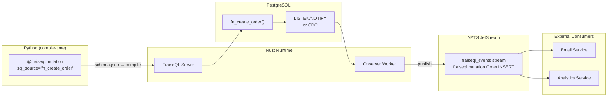

import { Aside, CardGrid, Card } from '@astrojs/starlight/components';

Advanced NATS patterns for building reliable, scalable event-driven systems with FraiseQL.

<Aside type="important">
**NATS integration is a Rust-level feature.** The Python SDK has no NATS API. There is no `nats.publish()`, no `@nats.subscribe()`, and no `@fraiseql.observer` decorator. Python's role is limited to defining the GraphQL schema. The Rust observer runtime detects mutations, publishes events to NATS, and invokes observer actions — all configured via TOML, not Python code.
</Aside>

## How NATS Fits Into FraiseQL

The data flow is:

1. A GraphQL client sends a mutation request to the FraiseQL Rust server
2. The Rust server calls your PostgreSQL mutation function (e.g. `fn_create_order`)
3. The Rust observer detects the mutation and publishes an event to NATS JetStream
4. External services subscribe to those NATS subjects and react

Python code defines the schema at compile time. All NATS communication happens inside the Rust runtime.



---

## Configuration

### Main Application Config (`fraiseql.toml`)

Enable the NATS observer backend in your main config file:

```toml title="fraiseql.toml"
[project]
name = "my-app"
version = "1.0.0"

[fraiseql]
schema_file   = "schema.json"
output_file   = "schema.compiled.json"

[observers]
backend   = "nats"
nats_url  = "${NATS_URL}"
```

`nats_url` is read from the `NATS_URL` environment variable at runtime. For a single server, use `nats://localhost:4222`. For a cluster, set `NATS_URL` to the URL of any cluster member — NATS client libraries handle cluster discovery automatically.

---

### Observer Worker Config (`fraiseql-observer.toml`)

The observer worker is a separate process that reads from NATS and executes observer actions. Its advanced transport settings live in `fraiseql-observer.toml`:

```toml title="fraiseql-observer.toml"
[transport]
transport = "nats"

[transport.nats]
url              = "${NATS_URL}"
stream_name      = "fraiseql_events"
subject_prefix   = "fraiseql.mutation"
consumer_name    = "fraiseql_observer_worker"

[transport.nats.jetstream]
max_bytes             = 10_737_418_240  # 10 GB retention limit
max_age_days          = 7               # Retain events for 7 days
max_deliver           = 3               # Retry delivery up to 3 times
ack_wait_secs         = 30              # Re-deliver if not acked within 30s
dedup_window_minutes  = 5               # Deduplicate messages within 5-min window
```

---

## NATS Subject Format

FraiseQL publishes events on subjects following this pattern:

```
{subject_prefix}.{EntityType}.{OPERATION}
```

With the default `subject_prefix = "fraiseql.mutation"`:

| Mutation | NATS Subject |
|----------|-------------|
| `fn_create_order` (INSERT) | `fraiseql.mutation.Order.INSERT` |
| `fn_update_order` (UPDATE) | `fraiseql.mutation.Order.UPDATE` |
| `fn_delete_order` (DELETE) | `fraiseql.mutation.Order.DELETE` |
| `fn_create_user` (INSERT)  | `fraiseql.mutation.User.INSERT` |

External consumers subscribe to these subjects directly using any NATS client library (Go, Node.js, Python nats.py, etc.).

---

## Mutations That Trigger Events

Define your mutation in Python (schema declaration only — no runtime code):

```python title="schema.py"
import fraiseql
from fraiseql.scalars import ID, DateTime

@fraiseql.type
class Order:
    id: ID
    identifier: str
    status: str
    total_amount: float
    created_at: DateTime

@fraiseql.input
class CreateOrderInput:
    items: list[str]
    shipping_address: str

@fraiseql.mutation(sql_source="fn_create_order", operation="CREATE")
def create_order(input: CreateOrderInput) -> Order:
    """Create an order. The Rust observer will publish to NATS after this succeeds."""
    pass
```

The PostgreSQL function does the work; the Rust observer publishes the NATS event after a successful commit:

```sql title="db/schema/fn_create_order.sql"
CREATE OR REPLACE FUNCTION fn_create_order(
    p_items             TEXT[],
    p_shipping_address  TEXT
)
RETURNS mutation_response LANGUAGE plpgsql AS $$
DECLARE
    v_id    UUID;
    v_pk    BIGINT;
    v_slug  TEXT := gen_random_uuid()::text;
BEGIN
    INSERT INTO tb_order (identifier, items, shipping_address, status)
    VALUES (v_slug, p_items, p_shipping_address, 'pending')
    RETURNING pk_order, id INTO v_pk, v_id;

    RETURN ROW(
        'success', NULL, v_id, 'Order',
        (SELECT data FROM v_order WHERE id = v_id),
        NULL, NULL, NULL
    )::mutation_response;
END;
$$;
```

After `fn_create_order` returns `status = 'success'`, the FraiseQL observer automatically publishes to `fraiseql.mutation.Order.INSERT`.

---

## PostgreSQL-Triggered NATS Events

For cases where you need to publish directly from the database (e.g. background jobs or triggers that fire outside of a FraiseQL mutation), use `pg_notify`. The FraiseQL observer listens on PostgreSQL channels and bridges to NATS:

```sql
-- PostgreSQL trigger publishes via LISTEN/NOTIFY
CREATE OR REPLACE FUNCTION notify_order_created()
RETURNS TRIGGER AS $$
BEGIN
    PERFORM pg_notify(
        'fraiseql_events',
        json_build_object(
            'entity_type', 'Order',
            'operation',   'INSERT',
            'entity_id',   NEW.id::text,
            'timestamp',   NOW()
        )::text
    );
    RETURN NEW;
END;
$$ LANGUAGE plpgsql;

CREATE TRIGGER tr_order_created
AFTER INSERT ON tb_order
FOR EACH ROW
EXECUTE FUNCTION notify_order_created();
```

The FraiseQL observer bridges `pg_notify` events to NATS JetStream, so external consumers still receive them on the standard subject.

---

## Reliability and Delivery Guarantees

### At-Least-Once Delivery

JetStream provides at-least-once delivery by default. The observer worker acknowledges each message after it successfully executes its action. If the worker crashes before acknowledging, NATS re-delivers after `ack_wait_secs`.

Configure in `fraiseql-observer.toml`:

```toml
[transport.nats.jetstream]
max_deliver   = 3    # Retry delivery up to 3 times
ack_wait_secs = 30   # Re-deliver if not acked within 30s
```

Your consumer logic must be **idempotent** — a message may arrive more than once.

### Dead Letter Queue

When `max_deliver` is exhausted, JetStream moves the message to the `$JS.EVENT.ADVISORY.CONSUMER.MAX_DELIVERIES.*` advisory subject. Monitor this subject to detect permanently failed events:

```toml title="fraiseql-observer.toml"
[transport.nats.jetstream]
max_deliver          = 3
dedup_window_minutes = 5   # Prevent reprocessing the same message within 5 min
```

### Event Deduplication

Set `dedup_window_minutes` to prevent duplicate processing when a message is re-delivered within the deduplication window. FraiseQL includes a message ID derived from the mutation's transaction ID in the NATS message headers, which JetStream uses for deduplication.

---

## Replay and Event History

JetStream retains events according to `max_age_days` and `max_bytes`. External consumers can replay history by subscribing with a `DeliverPolicy` set via their NATS client library:

```toml title="fraiseql-observer.toml"
[transport.nats.jetstream]
max_age_days = 7     # Events retained for 7 days
max_bytes    = 10_737_418_240  # Up to 10 GB
```

To replay from the start, configure your external consumer's NATS subscription with `DeliverAll` (or the equivalent in your client library). This is a client-side configuration, not a FraiseQL configuration.

---

## External Consumer Example (Python nats.py)

External services consume FraiseQL events using any NATS client library. Here is an example using the `nats-py` library — note this is your external service code, completely separate from the FraiseQL schema:

```python title="services/email_service/consumer.py"
"""External consumer for FraiseQL NATS events.

This is NOT part of the FraiseQL Python SDK.
It is a separate service that subscribes to FraiseQL NATS events
using the standard nats-py library.
"""
import asyncio
import json
import nats   # pip install nats-py — NOT fraiseql


NATS_URL = "nats://localhost:4222"
STREAM   = "fraiseql_events"
SUBJECT  = "fraiseql.mutation.Order.INSERT"


async def handle_order_created(msg):
    """Handle new order events from FraiseQL mutations."""
    event = json.loads(msg.data.decode())
    order_id   = event["entity_id"]
    order_data = event.get("entity", {})

    print(f"New order created: {order_id}")
    # ... send confirmation email, update analytics, etc.

    await msg.ack()  # Acknowledge after successful processing


async def main():
    nc = await nats.connect(NATS_URL)
    js = nc.jetstream()

    # Subscribe to FraiseQL Order INSERT events
    sub = await js.subscribe(
        SUBJECT,
        durable="email-service-order-handler",  # Durable = survives restart
        stream=STREAM,
    )

    async for msg in sub.messages:
        try:
            await handle_order_created(msg)
        except Exception as exc:
            print(f"Processing failed: {exc}")
            await msg.nak()  # Re-deliver after ack_wait_secs


if __name__ == "__main__":
    asyncio.run(main())
```

---

## Monitoring

The FraiseQL observer exposes Prometheus metrics with the `fraiseql_observer_` prefix:

| Metric | Description |
|--------|-------------|
| `fraiseql_observer_events_processed_total` | Total events processed successfully |
| `fraiseql_observer_events_failed_total` | Total events that failed processing |
| `fraiseql_observer_events_retried_total` | Total events redelivered by JetStream |
| `fraiseql_observer_processing_duration_seconds` | Histogram of event processing latency |

Monitor consumer lag via the NATS monitoring endpoint (`http://localhost:8222/jsz`) or via the `nats` CLI:

```bash
# Show consumer status and pending message count
nats consumer info fraiseql_events fraiseql_observer_worker

# Stream info (bytes, message count, retention)
nats stream info fraiseql_events
```

---

## Best Practices

<Aside type="tip">
**Design Checklist:**
- Use hierarchical subjects (`fraiseql.mutation.Entity.OPERATION`) for precise routing
- Make all consumers idempotent — JetStream guarantees at-least-once, not exactly-once
- Set `max_deliver` and `dedup_window_minutes` appropriate to your workload
- Use durable consumers so event processing survives worker restarts
- Set `max_age_days` and `max_bytes` to prevent unbounded JetStream growth
</Aside>

<Aside type="note">
**Configuration Checklist:**
- Set `NATS_URL` via environment variable — never hardcode credentials
- Separate the `fraiseql.toml` (server config) from `fraiseql-observer.toml` (observer worker config)
- Monitor `fraiseql_observer_events_failed_total` and alert when it rises
- Test with `nats consumer info` to confirm events are being delivered and acknowledged
</Aside>

---

## Next Steps

<CardGrid>
  <Card title="Federation + NATS Integration" icon="puzzle">
    [Distributed Coordination](/guides/federation-nats-integration) — Combine federation with NATS
  </Card>
  <Card title="Observer Webhook Patterns" icon="external">
    [Webhooks & Observers](/guides/observer-webhook-patterns) — External notifications
  </Card>
  <Card title="NATS Docs" icon="open-book">
    [Official NATS Documentation](https://docs.nats.io/) — Complete NATS reference
  </Card>
</CardGrid>
