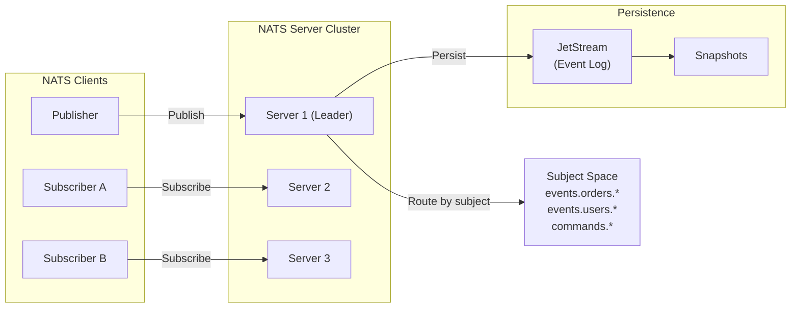

import { Aside, CardGrid, Card } from '@astrojs/starlight/components';

Advanced NATS patterns for building reliable, scalable event-driven systems with FraiseQL.

## NATS Architecture Overview

### Core Concepts



### Event Streaming with JetStream

FraiseQL integrates with NATS JetStream for durable event streaming:

```python
from fraiseql import nats, Subject, ConsumerGroup

# Enable NATS in configuration
# fraiseql.toml: [nats]
# enabled = true
# servers = ["nats://localhost:4222"]

@fraiseql.observer(
    entity="Order",
    event="CREATE"
)
async def on_order_created(order: Order):
    """Publish order creation events."""
    await nats.publish(
        subject="events.orders.created",
        data={
            "order_id": order.id,
            "user_id": order.user_id,
            "timestamp": order.created_at
        }
    )

@nats.subscribe(
    subject="events.orders.created",
    consumer_group="order_processors"
)
async def process_order_event(message):
    """Consume order creation events."""
    order_data = message.data
    await handle_new_order(order_data)
    await message.ack()  # Acknowledge after processing
```

---

## Advanced Event Streaming Patterns

### Publisher-Subscriber with Backpressure

```python
from fraiseql import nats
import asyncio

@fraiseql.observer(entity="Transaction", event="CREATE")
async def publish_transaction(transaction: Transaction):
    """
    Publish with backpressure handling.
    Prevents overwhelming subscribers.
    """
    try:
        await nats.publish(
            subject="events.transactions.created",
            data=transaction.to_dict(),
            timeout=5000  # 5s timeout
        )
    except nats.TimeoutError:
        # Backpressure: NATS server too busy
        await asyncio.sleep(1)
        # Retry with exponential backoff
        await nats.publish(...)

@nats.subscribe(
    subject="events.transactions.created",
    max_concurrent=10,  # Process 10 at a time
    drain_timeout=30000  # 30s to drain on shutdown
)
async def process_transactions(message):
    """Handle backpressure by limiting concurrency."""
    try:
        await heavy_processing(message.data)
        await message.ack()
    except Exception as e:
        await message.nak(timeout=5000)  # Requeue after 5s
```

### Subject-Based Routing

```python
# Hierarchical subject namespace
events.orders.created      # Order lifecycle
events.orders.updated
events.orders.shipped
events.orders.cancelled

events.payments.initiated  # Payment events
events.payments.succeeded
events.payments.failed

commands.orders.create     # Commands (different from events)
commands.orders.cancel

# Wildcard subscriptions
@nats.subscribe("events.orders.>")  # All order events
async def handle_order_events(msg):
    subject = msg.subject
    if subject == "events.orders.created":
        await handle_order_created(msg.data)
    elif subject == "events.orders.shipped":
        await handle_order_shipped(msg.data)

# Partial subscriptions
@nats.subscribe("events.*.created")  # All .created events
async def handle_created_events(msg):
    entity_type = msg.subject.split(".")[1]  # Extract "orders", "users", etc.
    await handle_creation(entity_type, msg.data)
```

### Request-Reply Pattern (Request/Response over NATS)

```python
from fraiseql import nats

# Service that responds to requests
@nats.handler("services.order.validate")
async def validate_order(request_data) -> dict:
    """
    Synchronous RPC-style request/reply.
    Useful for inter-service communication.
    """
    return {
        "valid": True,
        "estimated_delivery": "2 days"
    }

# Client making request
async def create_order_with_validation(order_data):
    """Make request and wait for reply."""
    response = await nats.request(
        subject="services.order.validate",
        data=order_data,
        timeout=5000
    )
    if response.valid:
        await create_order(order_data)
```

---

## Reliability & Guarantees

### At-Least-Once Delivery

```python
@nats.subscribe(
    subject="events.orders.created",
    deliver_policy="deliver_new",  # Only new events
    ack_policy="explicit"  # Manual ack required
)
async def process_order_exactly_once(message):
    """
    At-least-once delivery guarantee:
    - Message resent if not acked
    - Must be idempotent
    """
    try:
        # Idempotent processing
        await upsert_order_in_db(
            order_id=message.data.id,
            data=message.data
        )
        await message.ack()
    except Exception as e:
        # Don't ack - message will be redelivered
        await message.nak(timeout=5000)
```

### Exactly-Once Semantics with Deduplication

```python
import hashlib

@nats.subscribe("events.payments.processed")
async def handle_payment_exactly_once(message):
    """
    Achieve exactly-once by deduplicating.
    Track message ID in database.
    """
    message_id = message.metadata.sequence.stream

    # Check if we've processed this before
    existing = await db.query(
        "SELECT id FROM processed_messages WHERE message_id = $1",
        [message_id]
    )

    if existing:
        # Already processed, just ack
        await message.ack()
        return

    try:
        # Process payment
        await process_payment(message.data)

        # Record as processed
        await db.insert(
            "processed_messages",
            {"message_id": message_id, "processed_at": datetime.now()}
        )

        await message.ack()
    except Exception as e:
        await message.nak(timeout=10000)
```

### Consumer Groups & Load Balancing

```python
# Multiple consumers in same group = load balanced
# Multiple consumers in different groups = all get copy

@nats.subscribe(
    subject="events.orders.created",
    consumer_group="order_processors",  # Load balanced
    durable_name="order_processor_durable"  # Survives restart
)
async def process_order_1(message):
    """Processor 1 - gets some messages."""
    print(f"Processor 1 handling: {message.data}")
    await message.ack()

@nats.subscribe(
    subject="events.orders.created",
    consumer_group="order_processors",  # Same group
    durable_name="order_processor_durable"
)
async def process_order_2(message):
    """Processor 2 - gets other messages."""
    print(f"Processor 2 handling: {message.data}")
    await message.ack()

# With 2 subscribers in same consumer group:
# - Each message delivered to exactly one subscriber
# - Automatically load balanced
# - If processor 1 crashes, processor 2 handles its messages
```

---

## Event Replay & History

### Replay Policies

```python
from fraiseql.nats import DeliverPolicy

# 1. New messages only (default)
@nats.subscribe(
    subject="events.audit.>",
    deliver_policy=DeliverPolicy.DELIVER_NEW
)
async def audit_new_events(msg):
    """Only receives events created after subscription."""
    pass

# 2. All messages from start
@nats.subscribe(
    subject="events.audit.>",
    deliver_policy=DeliverPolicy.DELIVER_ALL
)
async def audit_replay_all(msg):
    """Replay entire event history."""
    pass

# 3. Last message in subject
@nats.subscribe(
    subject="events.users.>",
    deliver_policy=DeliverPolicy.DELIVER_LAST
)
async def user_state_sync(msg):
    """Get current state for each user."""
    pass

# 4. Messages from time range
@nats.subscribe(
    subject="events.orders.>",
    deliver_policy=DeliverPolicy.DELIVER_BY_START_TIME,
    start_time="2024-02-08T00:00:00Z"  # Last 24 hours
)
async def recent_orders(msg):
    """Replay last 24 hours of orders."""
    pass

# 5. Last N messages
@nats.subscribe(
    subject="events.transactions.>",
    deliver_policy=DeliverPolicy.DELIVER_LAST_PER_SUBJECT,
    opt_start_seq=100  # Last 100 per subject
)
async def recent_transactions(msg):
    """Last 100 transactions per type."""
    pass
```

### Temporal Queries (Time-Travel)

```python
import datetime

async def get_user_state_at_time(user_id: ID, at_time: datetime):
    """
    Reconstruct user state at a point in time.
    Replay events up to that point.
    """
    events = await nats.query_stream(
        subject=f"events.users.{user_id}",
        start_time=datetime.datetime(2024, 1, 1),
        end_time=at_time
    )

    # Replay events to reconstruct state
    user_state = {"id": user_id, "created_at": at_time}
    for event in events:
        if event.type == "created":
            user_state.update(event.data)
        elif event.type == "updated":
            user_state.update(event.data)
        elif event.type == "deleted":
            return None

    return user_state
```

---

## Error Handling & Dead Letter Queues

### DLQ Pattern

```python
from fraiseql import nats

@nats.subscribe(
    subject="events.payments.processed",
    max_retries=3,
    retry_backoff="exponential"
)
async def process_payment(message):
    """Process payment with retries."""
    try:
        await charge_customer(message.data)
        await message.ack()
    except Exception as e:
        # Automatic retry on nak
        await message.nak(timeout=5000)

# Dead letter handler
@nats.subscribe(
    subject="events.payments.dlq",
    durable_name="payment_dlq_handler"
)
async def handle_failed_payment(message):
    """
    Handle permanently failed payments.
    Invoked after max_retries exceeded.
    """
    order_id = message.data.order_id
    await send_alert(f"Payment failed for order {order_id}")
    await store_failed_payment(message.data)
    await message.ack()
```

---

## Database-Triggered Events

### Dual-Write Prevention

```python
# Problem: Mutations trigger events AND direct DB writes
# Solution: Use database triggers as single source of truth

@fraiseql.mutation(operation="CREATE")
def create_order(user_id: ID, items: list) -> Order:
    """Database trigger handles NATS publication."""
    pass
```

```sql
-- PostgreSQL trigger publishes to NATS
CREATE FUNCTION publish_order_created() RETURNS TRIGGER AS $$
BEGIN
  PERFORM pg_notify('order_created', json_build_object(
    'order_id', NEW.id,
    'user_id', NEW.user_id,
    'timestamp', NEW.created_at
  )::text);
  RETURN NEW;
END;
$$ LANGUAGE plpgsql;

CREATE TRIGGER tr_order_created
AFTER INSERT ON tb_order
FOR EACH ROW EXECUTE FUNCTION publish_order_created();
```

### Event Sourcing Pattern

```python
@fraiseql.observer(entity="Order", event="CREATE")
async def append_to_event_log(order: Order):
    """Append to immutable event log."""
    await nats.publish(
        subject="event_log.orders",
        data={
            "event_type": "OrderCreated",
            "aggregate_id": order.id,
            "data": order.to_dict(),
            "timestamp": order.created_at,
            "version": 1
        }
    )

@fraiseql.observer(entity="Order", event="UPDATE")
async def append_order_updated(order: Order, previous: Order):
    """Track all updates."""
    version = await get_latest_version(order.id)
    await nats.publish(
        subject="event_log.orders",
        data={
            "event_type": "OrderUpdated",
            "aggregate_id": order.id,
            "data": {
                "changes": diff_objects(previous, order)
            },
            "timestamp": datetime.now(),
            "version": version + 1
        }
    )
```

---

## Monitoring & Metrics

### JetStream Metrics

```python
# Monitor consumer lag
@fraiseql.job(interval=60000)  # Every minute
async def check_consumer_lag():
    """Alert if subscribers fall behind."""
    for consumer in await nats.list_consumers():
        lag = consumer.num_pending
        if lag > 1000:
            await send_alert(f"Consumer {consumer.name} lagging: {lag} messages")

# Monitor stream size
@fraiseql.job(interval=300000)  # Every 5 minutes
async def check_stream_size():
    """Prevent running out of storage."""
    for stream in await nats.list_streams():
        if stream.bytes > MAX_STREAM_SIZE * 0.9:  # 90% full
            await send_alert(f"Stream {stream.name} approaching limit")
```

### Performance Metrics

```python
# Prometheus metrics
fraiseql_nats_publish_duration_seconds  # Message publish latency
fraiseql_nats_subscribe_lag_seconds     # Subscriber lag
fraiseql_nats_errors_total             # Failed messages
fraiseql_nats_consumer_pending         # Messages waiting to be processed
```

---

## Integration with FraiseQL

### Database-NATS Integration

In `fraiseql.toml`, enable NATS via the observers backend:

```toml
[observers]
enabled = true
backend = "nats"
nats_url = "${NATS_URL}"  # comma-separated for clusters: nats://n1:4222,nats://n2:4222
```

Advanced JetStream settings belong in the observer runtime config (`fraiseql-observer.toml`):

```toml
[transport]
transport = "nats"

[transport.nats]
url = "${NATS_URL}"
stream_name = "fraiseql_events"
subject_prefix = "fraiseql.mutation"
consumer_name = "fraiseql_observer_worker"

[transport.nats.jetstream]
max_bytes = 10_737_418_240  # 10 GB
max_age_days = 7
max_deliver = 3
ack_wait_secs = 30
dedup_window_minutes = 5
```

### Custom Event Publishing

```python
from fraiseql import observer, nats

@fraiseql.observer(
    entity="Order",
    event="CREATE",
    database="primary"
)
async def on_order_created(order: Order, ctx):
    """
    Publish custom event with business context.
    """
    await nats.publish(
        subject=f"events.orders.{order.user_id}.created",
        data={
            "order_id": str(order.id),
            "user_id": str(order.user_id),
            "total": float(order.total),
            "items_count": len(order.items),
            "timestamp": order.created_at.isoformat()
        },
        headers={
            "source": "order-service",
            "version": "1",
            "correlation_id": ctx.request_id
        }
    )
```

---

## Best Practices

<Aside type="tip">
**Design Checklist:**
- Use hierarchical subjects (e.g., `events.entity.action`)
- Make consumers idempotent (handle duplicate messages)
- Implement circuit breakers for external calls
- Use consumer groups for load distribution
- Set appropriate retention policies
</Aside>

<Aside type="note">
**Implementation Checklist:**
- Always use explicit ack for reliability
- Implement DLQ for failed messages
- Add correlation IDs to track events
- Handle backpressure with max_concurrent
- Graceful shutdown with drain timeout
</Aside>

---

## Next Steps

<CardGrid>
  <Card title="Federation + NATS Integration" icon="puzzle">
    [Distributed Coordination](/guides/federation-nats-integration) — Combine federation with NATS
  </Card>
  <Card title="Observer Webhook Patterns" icon="external">
    [Webhooks & Observers](/guides/observer-webhook-patterns) — External notifications
  </Card>
  <Card title="NATS Docs" icon="open-book">
    [Official NATS Documentation](https://docs.nats.io/) — Complete NATS reference
  </Card>
</CardGrid>
