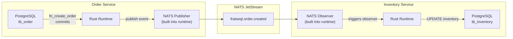

import { Aside, CardGrid, Card } from '@astrojs/starlight/components';

In a FraiseQL federation, NATS is the **infrastructure layer** that carries events between services. When a mutation in Service A completes, the FraiseQL Rust runtime publishes an event to a NATS subject. Service B's Rust runtime subscribes to that subject and triggers its observers.

There is no Python NATS API. Python appears only at **compile time** (schema definition). Event routing at runtime is pure infrastructure: TOML configuration tells the Rust runtime which topics to publish to and which to subscribe to.

## How Events Flow Between Services



### What Python Controls (compile time)

Python schemas define **what types exist and what mutations do**:

```python title="order-service/schema.py"
import fraiseql
from fraiseql.scalars import ID, Decimal, DateTime
from enum import Enum

@fraiseql.enum
class OrderStatus(Enum):
    PENDING = "pending"
    CONFIRMED = "confirmed"
    SHIPPED = "shipped"

@fraiseql.type
class Order:
    id: ID
    user_id: ID
    status: OrderStatus
    total: Decimal
    created_at: DateTime

@fraiseql.input
class CreateOrderInput:
    user_id: ID
    items: list[str]

@fraiseql.mutation(sql_source="fn_create_order", operation="CREATE")
def create_order(input: CreateOrderInput) -> Order:
    """Create a new order."""
    pass

fraiseql.export_schema("schema.json")
```

### What TOML Controls (runtime)

TOML configuration tells the Rust runtime to publish events after mutations succeed, and which NATS subjects to observe:

```toml title="order-service/fraiseql.toml"
[database]
type = "postgresql"
url = "${DATABASE_URL}"

[observers]
backend = "nats"
nats_url = "${NATS_URL}"

# Publish to NATS after these mutations succeed
[[observers.publish]]
mutation = "create_order"
subject = "fraiseql.order.created"

[[observers.publish]]
mutation = "update_order"
subject = "fraiseql.order.updated"
```

```toml title="inventory-service/fraiseql.toml"
[database]
type = "postgresql"
url = "${DATABASE_URL}"

[observers]
backend = "nats"
nats_url = "${NATS_URL}"

# Subscribe to NATS subjects and trigger SQL observers
[[observers.subscribe]]
subject = "fraiseql.order.created"
handler = "fn_reserve_inventory"
```

---

## Pattern 1: Mutation in Service A Triggers Update in Service B

The most common cross-service pattern: a mutation in the Order service causes the Inventory service to update its records.

### Order Service

The Order service schema defines the mutation. No NATS code appears here — the Rust runtime handles publishing based on `fraiseql.toml`.

```python title="order-service/schema.py"
import fraiseql
from fraiseql.scalars import ID, Decimal

@fraiseql.type
class Order:
    id: ID
    user_id: ID
    total: Decimal

@fraiseql.input
class CreateOrderInput:
    user_id: ID
    item_ids: list[str]

@fraiseql.mutation(sql_source="fn_create_order", operation="CREATE")
def create_order(input: CreateOrderInput) -> Order:
    """Create a new order. The Rust runtime publishes an event after this commits."""
    pass

fraiseql.export_schema("schema.json")
```

```toml title="order-service/fraiseql.toml"
[database]
type = "postgresql"
url = "${DATABASE_URL}"

[observers]
backend = "nats"
nats_url = "${NATS_URL}"

[[observers.publish]]
mutation = "create_order"
subject = "fraiseql.order.created"
```

The `fn_create_order` SQL function in the Order database:

```sql title="order-service/migrations/001_create_order.sql"
CREATE TABLE tb_order (
    pk_order   BIGINT  GENERATED ALWAYS AS IDENTITY PRIMARY KEY,
    id         UUID    DEFAULT gen_random_uuid() UNIQUE NOT NULL,
    identifier TEXT    UNIQUE NOT NULL,
    user_id    UUID    NOT NULL,
    status     TEXT    NOT NULL DEFAULT 'pending',
    total      NUMERIC(12,2) NOT NULL,
    created_at TIMESTAMPTZ DEFAULT now() NOT NULL
);

CREATE FUNCTION fn_create_order(
    p_user_id UUID,
    p_item_ids TEXT[]
) RETURNS mutation_response AS $$
DECLARE
    v_order tb_order;
    v_total NUMERIC(12,2) := 0;
BEGIN
    INSERT INTO tb_order (identifier, user_id, total)
    VALUES (
        'ORD-' || extract(epoch from now())::bigint,
        p_user_id,
        v_total
    )
    RETURNING * INTO v_order;

    RETURN ROW(
        'success',
        'Order created',
        v_order.id,
        'Order',
        row_to_json(v_order)::jsonb,
        NULL,
        NULL,
        jsonb_build_object('item_ids', p_item_ids)
    )::mutation_response;
END;
$$ LANGUAGE plpgsql;
```

### Inventory Service

The Inventory service subscribes to `fraiseql.order.created`. The NATS observer triggers a SQL function that reserves inventory. Again, no Python handles the subscription — only TOML and SQL.

```python title="inventory-service/schema.py"
import fraiseql
from fraiseql.scalars import ID

@fraiseql.type
class InventoryItem:
    id: ID
    sku: str
    quantity_available: int
    quantity_reserved: int

@fraiseql.query(sql_source="v_inventory_item")
def inventory_item(sku: str) -> InventoryItem | None:
    """Look up inventory for a SKU."""
    pass

fraiseql.export_schema("schema.json")
```

```toml title="inventory-service/fraiseql.toml"
[database]
type = "postgresql"
url = "${DATABASE_URL}"

[observers]
backend = "nats"
nats_url = "${NATS_URL}"

[[observers.subscribe]]
subject = "fraiseql.order.created"
handler = "fn_reserve_inventory"
```

The handler function receives the event payload (the serialized `Order` object) and updates the inventory database:

```sql title="inventory-service/migrations/002_reserve_inventory.sql"
CREATE FUNCTION fn_reserve_inventory(
    p_event JSONB
) RETURNS VOID AS $$
DECLARE
    v_item_ids TEXT[];
    v_item_id TEXT;
BEGIN
    -- Extract item IDs from the event payload's metadata
    v_item_ids := ARRAY(
        SELECT jsonb_array_elements_text(p_event->'metadata'->'item_ids')
    );

    FOREACH v_item_id IN ARRAY v_item_ids LOOP
        UPDATE tb_inventory_item
        SET
            quantity_reserved = quantity_reserved + 1,
            quantity_available = quantity_available - 1
        WHERE identifier = v_item_id
          AND quantity_available > 0;
    END LOOP;
END;
$$ LANGUAGE plpgsql;
```

---

## Pattern 2: Event Fan-Out to Multiple Services

One mutation event can be consumed by multiple services. The Notification service and the Analytics service both react to `fraiseql.order.created` independently.

```toml title="notification-service/fraiseql.toml"
[database]
type = "postgresql"
url = "${DATABASE_URL}"

[observers]
backend = "nats"
nats_url = "${NATS_URL}"

[[observers.subscribe]]
subject = "fraiseql.order.created"
handler = "fn_queue_order_confirmation_email"

[[observers.subscribe]]
subject = "fraiseql.order.shipped"
handler = "fn_queue_shipping_notification"
```

```toml title="analytics-service/fraiseql.toml"
[database]
type = "postgresql"
url = "${DATABASE_URL}"

[observers]
backend = "nats"
nats_url = "${NATS_URL}"

[[observers.subscribe]]
subject = "fraiseql.order.created"
handler = "fn_record_order_event"

[[observers.subscribe]]
subject = "fraiseql.order.updated"
handler = "fn_record_order_event"
```

NATS JetStream's subject-based routing delivers the same message to all subscribers independently. The Order service publishes once; any number of consumer groups receive the event.

---

## Pattern 3: Subscription Propagation via NATS

GraphQL subscriptions in FraiseQL are also sourced through the NATS/observer layer. When a mutation fires an event in Service A, clients subscribed to Service B can receive a real-time update.

### Order Service — Subscriptions Schema

```python title="order-service/schema.py"
import fraiseql
from fraiseql.scalars import ID, Decimal

@fraiseql.type
class Order:
    id: ID
    user_id: ID
    status: str
    total: Decimal

@fraiseql.subscription(entity_type="Order", topic="order_status_changed", operation="UPDATE")
def order_status_changed(order_id: ID | None = None) -> Order:
    """Subscribe to order status changes. Optionally filter by order_id."""
    pass

fraiseql.export_schema("schema.json")
```

```toml title="order-service/fraiseql.toml"
[database]
type = "postgresql"
url = "${DATABASE_URL}"

[observers]
backend = "nats"
nats_url = "${NATS_URL}"

# Publish order updates — drives both NATS observers and GraphQL subscriptions
[[observers.publish]]
mutation = "update_order_status"
subject = "fraiseql.order.status_changed"
subscription_topic = "order_status_changed"
```

The Rust runtime bridges NATS events to WebSocket subscription clients automatically. Client subscription filters (`order_id`) are applied by the runtime against incoming events.

---

## NATS JetStream Configuration

For production, enable NATS JetStream for durable, replay-capable event streams. Configure streams and consumer groups outside of FraiseQL (in your NATS server config or via `nats` CLI).

### NATS Server Configuration

```conf title="nats-server.conf"
port: 4222

jetstream {
  store_dir: /data/nats
  max_mem: 1GB
  max_file: 50GB
}
```

### Creating Streams

```bash
# Create a durable stream for order events
nats stream add ORDERS \
  --subjects "fraiseql.order.*" \
  --storage file \
  --retention limits \
  --max-age 7d \
  --replicas 3

# Create consumer groups for each subscribing service
nats consumer add ORDERS inventory-service \
  --filter "fraiseql.order.created" \
  --deliver all \
  --ack explicit \
  --max-deliver 5
```

FraiseQL's `[observers]` backend connects to this NATS server. Consumer group names map to service names in your TOML.

---

## Consistency Considerations

### Events are Post-Commit

The FraiseQL Rust runtime publishes to NATS **after** the database transaction commits. This means:

- The mutation is durable before the event fires
- If NATS is unavailable at publish time, the event may be lost (use JetStream with at-least-once delivery for production)
- Subscribing services see events with eventual consistency — they do not see the write until the event arrives

### At-Least-Once Delivery

With NATS JetStream, events are delivered at least once. Your SQL handler functions must be idempotent:

```sql
-- Idempotent reservation: use INSERT ... ON CONFLICT DO NOTHING
-- or check before updating
CREATE FUNCTION fn_reserve_inventory(p_event JSONB) RETURNS VOID AS $$
BEGIN
    -- Idempotent: only reserve if not already reserved for this order
    INSERT INTO tb_reservation (order_id, sku)
    SELECT
        (p_event->>'id')::uuid,
        jsonb_array_elements_text(p_event->'metadata'->'item_ids')
    ON CONFLICT (order_id, sku) DO NOTHING;
END;
$$ LANGUAGE plpgsql;
```

### Query-Side Reads After Mutations

Because subscribing services update asynchronously, a client that reads from Service B immediately after mutating through Service A may see stale data. Design your UI to handle eventual consistency — show optimistic state or poll until the event has propagated.

---

## Observability

Each FraiseQL Rust runtime logs NATS events it publishes and receives. Use structured logging and NATS monitoring together.

```toml title="any-service/fraiseql.toml"
[fraiseql.security.audit_logging]
enabled = true
log_level = "info"
async_logging = true
```

NATS server exposes monitoring at `http://nats:8222`:
- `/jsz` — JetStream stream and consumer stats
- `/varz` — server variables and connection counts
- `/connz` — active connections

---

## Complete TOML Reference for Observer Configuration

```toml
# The observer backend
[observers]
backend = "nats"          # "nats", "redis", or "postgres"
nats_url = "${NATS_URL}"  # Used when backend = "nats"
redis_url = "${REDIS_URL}" # Used when backend = "redis"

# Publish an event to NATS after a mutation commits
[[observers.publish]]
mutation = "create_order"       # Must match a @fraiseql.mutation function name
subject = "fraiseql.order.created"  # NATS subject to publish on
# Optional: also drive GraphQL subscription clients
subscription_topic = "order_created"

# Subscribe to a NATS subject and invoke a SQL handler
[[observers.subscribe]]
subject = "fraiseql.order.created"  # NATS subject to subscribe to
handler = "fn_reserve_inventory"    # SQL function name in this service's database
# handler receives the event payload as a JSONB argument
```

<Aside type="note">
The `handler` value in `[[observers.subscribe]]` must be a SQL function that exists in the service's own database. The function receives the event payload as a single `JSONB` parameter. FraiseQL does not support Python-based subscription handlers at runtime.
</Aside>

---

## Next Steps

<CardGrid>
  <Card title="Federation Configuration" icon="setting">
    [Per-Service TOML](/guides/federation-configuration) — Database and security configuration for each subgraph
  </Card>
  <Card title="Advanced Federation" icon="puzzle">
    [Apollo Federation v2](/guides/advanced-federation) — Subgraph schemas and Apollo Router composition
  </Card>
  <Card title="Observers Guide" icon="external">
    [Observers](/guides/observers) — Post-mutation side effects and event publishing
  </Card>
</CardGrid>
