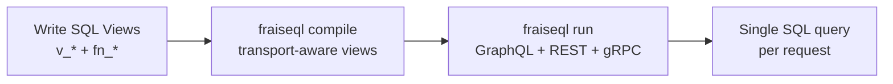

import { Card, CardGrid, Tabs, TabItem } from '@astrojs/starlight/components';

## Three Transports, One Binary

`fraiseql run` serves GraphQL, REST, and gRPC simultaneously on a single port. Same auth, same rate limiting, same database pool.

<CardGrid>
  <Card title="GraphQL" icon="document">
    Full schema auto-generation. Queries, mutations, subscriptions. Introspection, APQ, trusted documents.

    [GraphQL API Reference](/reference/graphql-api/)
  </Card>
  <Card title="REST" icon="rocket">
    Annotation-driven endpoints. OpenAPI spec auto-generated. HTTP status code mapping.

    [REST Transport](/features/rest-transport/)
  </Card>
  <Card title="gRPC" icon="approve-check">
    Transport-aware DB views skip JSON. Auto-generated `.proto` files. Server streaming for subscriptions.

    [gRPC Transport](/features/grpc-transport/)
  </Card>
</CardGrid>

```
SDK decorators (Python, TypeScript, Go, +10 more)
        ↓
  fraiseql compile
        ↓
 schema.compiled.json
        ↓
   fraiseql run (single Rust binary, port 8080)
     ╱         |          ╲
GraphQL        REST        gRPC
POST /graphql  GET /rest/..  UserService/GetUser
  JSON          JSON          Protobuf
     ╲         |          ╱
  Transport-aware DB views
        ↓
PostgreSQL · MySQL · SQL Server · SQLite
```

## A Different Path

Most API servers require separate services for different API styles — a GraphQL service, a REST API, and a gRPC service. Three codebases, three deployments, three auth configurations.

**FraiseQL collapses this into one.** You write SQL views that compose into your API shape. FraiseQL compiles them into transport-aware database views — JSON-shaped for GraphQL and REST, row-shaped for gRPC. The database does the work — one query, every time.

<CardGrid>
  <Card title="You Own the SQL" icon="rocket">
    Write SQL views with full database power — CTEs, window functions, custom aggregations. Works with PostgreSQL, SQL Server, MySQL, and SQLite. Or let an AI generate them.
  </Card>
  <Card title="Zero N+1 by Design" icon="approve-check">
    Relationships are pre-composed as JSONB at the view level. One `SELECT data FROM v_post` returns the entire nested response. No DataLoader. No batching.
  </Card>
  <Card title="🍯 Confiture Your Database" icon="puzzle">
    *Confiture* — sounds like *configure*, tastes like jam. Fresh database in under 1 second. Incremental migrations. Production sync with anonymization. Zero-downtime refactoring. Four strategies for every scenario.
  </Card>
  <Card title="TOML Configuration" icon="document">
    Human-readable configuration. No YAML complexity. Your entire backend config fits in one file you can actually read.
  </Card>
</CardGrid>

## How It Works



1. **Write** SQL views following the `.data` JSONB pattern (`v_user`, `v_post`, ...)
2. **Compile** — generates JSON-shaped views for GraphQL/REST, row-shaped views for gRPC
3. **Serve** — all three transports on port 8080

The complexity lives in the database, where it belongs — not in runtime resolvers.

## Quick Example

**Your SQL view:**

<Tabs syncKey="db">
  <TabItem label="PostgreSQL">
    ```sql title="db/schema/02_read/v_user.sql"
    CREATE VIEW v_user AS
    SELECT
        u.id,
        jsonb_build_object(
            'id', u.id::text,
            'name', u.name,
            'email', u.email
        ) AS data
    FROM tb_user u;
    ```
  </TabItem>

  <TabItem label="MySQL">
    ```sql title="db/schema/02_read/v_user.sql"
    CREATE VIEW v_user AS
    SELECT
        u.id,
        JSON_OBJECT(
            'id', u.id,
            'name', u.name,
            'email', u.email
        ) AS data
    FROM tb_user u;
    ```
  </TabItem>

  <TabItem label="SQLite">
    ```sql title="db/schema/02_read/v_user.sql"
    CREATE VIEW v_user AS
    SELECT
        u.id,
        json_object(
            'id', u.id,
            'name', u.name,
            'email', u.email
        ) AS data
    FROM tb_user u;
    ```
  </TabItem>

  <TabItem label="SQL Server">
    ```sql title="db/schema/02_read/v_user.sql"
    CREATE VIEW dbo.v_user
    WITH SCHEMABINDING AS
    SELECT
        u.id,
        (
            SELECT u.id, u.name, u.email
            FOR JSON PATH, WITHOUT_ARRAY_WRAPPER
        ) AS data
    FROM dbo.tb_user u;
    ```
  </TabItem>
</Tabs>

**Your GraphQL schema:**

<Tabs syncKey="lang">
  <TabItem label="Python">
    ```python title="schema.py"
    import fraiseql
    from fraiseql.scalars import ID

    @fraiseql.type
    class User:
        id: ID
        name: str
        email: str
        posts: list['Post']

    @fraiseql.type
    class Post:
        id: ID
        title: str
        content: str
        author: User
    ```
  </TabItem>

  <TabItem label="TypeScript">
    ```typescript title="schema.ts"
    import { type } from 'fraiseql';

    @type()
    class User {
      id: string;
      name: string;
      email: string;
      posts: Post[];
    }

    @type()
    class Post {
      id: string;
      title: string;
      content: string;
      author: User;
    }
    ```
  </TabItem>

  <TabItem label="Go">
    ```go title="schema.go"
    package schema

    // User represents a user with posts
    type User struct {
        ID    string `fraiseql:"type"`
        Name  string
        Email string
        Posts []Post
    }

    // Post represents a blog post
    type Post struct {
        ID      string `fraiseql:"type"`
        Title   string
        Content string
        Author  User
    }
    ```
  </TabItem>
</Tabs>

**Add transport annotations (optional):**

```python title="schema.py"
@fraiseql.query(
    sql_source="v_user",
    rest_path="/users/{id}",    # REST: GET /rest/users/{id}
    rest_method="GET",
    grpc_service="UserService",
    grpc_method="GetUser",      # gRPC: UserService/GetUser
)
def get_user(id: UUID) -> User: ...
```

**Compile and serve:**

```bash
$ fraiseql compile && fraiseql run --database $DATABASE_URL
✓ Compiled 2 types → transport-aware SQL views
✓ Built query executor
→ GraphQL  http://localhost:8080/graphql
→ REST      http://localhost:8080/rest/v1/  (default path; configure via [fraiseql.rest] path)
→ gRPC      localhost:8080 (HTTP/2)
```

## Why Database-First?

> "If you can write a SQL view, you can build a GraphQL API. If an LLM can write a SQL view, it can build one too."

FraiseQL is built on a bet: developers (and AI agents) are better off owning their SQL than hiding behind abstractions. The view pattern is 12 lines. Local models generate it accurately. And you get the full power of your database — PostgreSQL, SQL Server, MySQL, or SQLite — not a subset an ORM decided to expose.

<CardGrid>
  <Card title="For Developers" icon="laptop">
    Write views you can read, debug, and explain. No resolver boilerplate. Predictable query plans. Type-safe SDKs in 11 languages. Transport annotations optional — add REST or gRPC when you need them.
  </Card>
  <Card title="For Teams" icon="group">
    SQL views are reviewable in PRs. 🍯 Confiture handles migrations. TOML config is readable. The whole stack is auditable.
  </Card>
</CardGrid>

## Enterprise Features

FraiseQL v2.1.0 is production-ready with comprehensive security, scaling, and integration capabilities.

<CardGrid>
  <Card title="Security & Access Control" icon="shield">
    [RBAC with role hierarchy](/features/security) · [Field-level encryption](/features/encryption) · [Audit logging](/features/audit-logging) · [Rate limiting](/features/rate-limiting)
  </Card>
  <Card title="Custom Types & Validation" icon="document">
    [49+ semantic scalar types](/reference/semantic-scalars) · [Custom scalar types with Elo validation](/concepts/elo-validation) · [Comprehensive validation rules](/reference/validation-rules)
  </Card>
  <Card title="Real-Time & Subscriptions" icon="rocket">
    [GraphQL subscriptions](/features/subscriptions) — WebSocket, Webhook, Kafka, LISTEN/NOTIFY · [gRPC server streaming](/features/grpc-transport/) · [Observer pattern](/concepts/observers) for event-driven logic
  </Card>
  <Card title="Performance & Caching" icon="approve-check">
    [Query result caching](/features/caching) · [Automatic Persisted Queries (APQ)](/features/apq) · [Apache Arrow dataplane](/features/arrow-dataplane) · [Wire protocol optimization](/features/wire-protocol)
  </Card>
  <Card title="Integration & Federation" icon="puzzle">
    [Webhooks](/features/webhooks) with retry & DLQ · [NATS JetStream](/features/nats) messaging · [Apollo Federation](/features/federation) · [Multi-database federation](/guides/federation-configuration)
  </Card>
  <Card title="Developer Experience" icon="laptop">
    [🍯 Confiture](/confiture) — database generation & migrations · [Type-safe SDKs](/sdk) in 11 languages · [TOML configuration](/reference/toml-config) · [Comprehensive CLI](/reference/cli)
  </Card>
  <Card title="AI-Assisted Development" icon="star">
    [Generate SQL views](/ai/generating-views) with Claude, GPT-4o, or local Ollama models. Copy-paste prompts for every scenario. You review plain SQL in a PR — no black box.
  </Card>
  <Card title="Starter Templates" icon="open-book">
    [Minimal](/getting-started/starters#minimal) — SQLite, zero Docker · [Blog API](/getting-started/starters#blog-api) — PostgreSQL, posts, comments, tags · [SaaS](/getting-started/starters#saas) — multi-tenant RLS + JWT · [**Auth**](/getting-started/starters#auth) — `@inject`, RLS, structured errors.
  </Card>
</CardGrid>

## Learn More

**Getting Started:**
- [5-Minute Quickstart](/getting-started/five-minute-quickstart) — Docker-based, zero install
- [Manual Setup](/getting-started/quickstart) — Install locally, use your own database
- [Adding Mutations](/getting-started/adding-mutations) — Add the write path to your API
- [How It Works](/concepts/how-it-works) — Deep dive into architecture
- [AI-Assisted SQL Generation](/ai) — Generate views with Claude, GPT, or local models

**Transports:**
- [Transport Overview](/transports/) — GraphQL, REST, and gRPC from one binary
- [REST Transport](/features/rest-transport/) — Annotation-driven REST, OpenAPI
- [gRPC Transport](/features/grpc-transport/) — Transport-aware DB views, .proto generation
- [REST vs GraphQL](/guides/rest-vs-graphql/) — When to use each (you don't have to choose)

**Core Concepts:**
- [Schema & Types](/concepts/schema) — Type system fundamentals
- [Developer-Owned SQL](/concepts/developer-owned-sql) — Database-first philosophy
- [CQRS Pattern](/concepts/cqrs) — Separating reads and writes
- [Observers](/concepts/observers) — Event-driven logic

**Advanced Guides:**
- [Custom Scalars](/guides/custom-scalars) — Create domain-specific types
- [Elo Validation Language](/concepts/elo-validation) — Expressive validation rules
- [Observer-Webhook Patterns](/guides/observer-webhook-patterns) — Event-driven workflows
- [Multi-Database Federation](/guides/federation-configuration) — Query across databases
- [Multi-Tenancy](/guides/multi-tenancy) — Secure data isolation

**Reference:**
- [Decorators](/reference/decorators) — Full decorator reference
- [Scalar Types](/reference/scalars) — Type reference
- [Query Operators](/reference/operators) — Rich filters and operators
- [TOML Configuration](/reference/toml-config) — All config options
